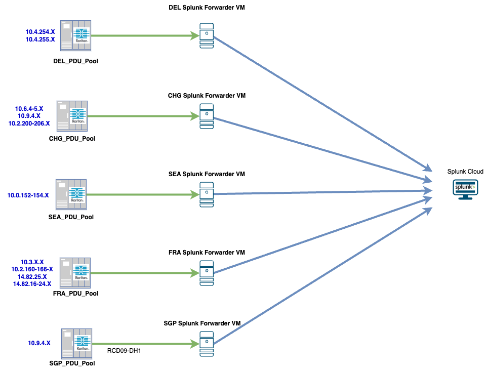

# Overview

## About This Solution

This solution provides a robust framework for real-time monitoring and proactive management of power distribution within a Data Center environment. By leveraging SNMP-based data collection and the power of the Splunk platform, the system transforms raw hardware metrics into actionable insights.

### Architecture and Data Flow

The solution follows a streamlined data pipeline to ensure visibility and reliability:

- **Data Collection (SNMP/OIDs):** The Splunk Universal Forwarder polls Power Distribution Units (PDUs) using Simple Network Management Protocol (SNMP). By targeting specific Object Identifiers (OIDs), the system captures granular metrics regarding power consumption, load, and outlet status.

- **Data Transmission (Splunk Universal Forwarder):** The Splunk Universal Forwarder (UF) acts as the collection agent, gathering PDU SNMP records and securely transmitting them to the Splunk Cloud environment. Its lightweight architecture ensures data capture with minimal impact on host system performance. It also provides reliable delivery through data buffering and persistent queues, ensuring no information is lost during temporary network interruptions.

- **Visualization and Analysis (Splunk Cloud):** Once ingested into Splunk Cloud, data is indexed and processed for real-time search and analytics. Sophisticated dashboards transform raw SNMP records into actionable insights, providing clear visibility into power trends, network topology, and granular outlet-level consumption.

### Key Capabilities and Benefits

- **Proactive Power Management:** Monitor power capacity in real-time to identify potential overloads before they occur, preventing power outages and equipment downtime.

- **Capacity Planning:** Gain a clear understanding of the lab's total power capacity, enabling data-driven decisions for adding new equipment and scaling infrastructure.

- **Topology Mapping:** Integrate the power topology — from transformers and panels down to the PDU — giving users visibility into the power delivery chain for faster troubleshooting.

- **Device-Level Granularity:** Outlet-level metrics identify exactly which devices are consuming power, enabling precise chargeback models, energy efficiency auditing, and better inventory management.

### Strategic Impact

Implementing this solution shifts lab management from reactive to proactive. By maintaining a high-fidelity view of power usage, the organization can:

- **Minimize Downtime:** Reduce the risk of circuit trips and power failures.
- **Optimize Efficiency:** Identify underutilized or inefficient devices.
- **Enhance Operational Intelligence:** Utilize historical data to forecast future power requirements as the lab grows.

## Scenarios

The following architecture illustrates the end-to-end SNMP telemetry ingestion pipeline. It demonstrates how power data is collected from various PDU pools across global Data Center sites — including DEL, CHG, SEA, FRA, and SGP — aggregated by regional Splunk Forwarder VMs and centralized into Splunk Cloud.

<figure markdown>
  
</figure>

To gain hands-on experience with this infrastructure, progress through the following scenarios and tasks:

1. [Navigating Smart PDU Dashboard](scenario01.md)
2. [Navigating Splunk Cloud Dashboard](scenario02.md)
3. [Data Center Power Infrastructure: Capacity and Topology Analysis](scenario03.md)
4. [Data Center Environmental Monitoring and Temperature Analysis](scenario04.md)
5. [PDU Operational Status and Availability Tracking](scenario05.md)
6. [PDU Outlet View and Phase Balancing](scenario06.md)
7. [Interact with Data Using the CLI Script](task01.md)

## Learning Objectives

Upon completion of this lab, you will be able to:


- {{ obj }}

