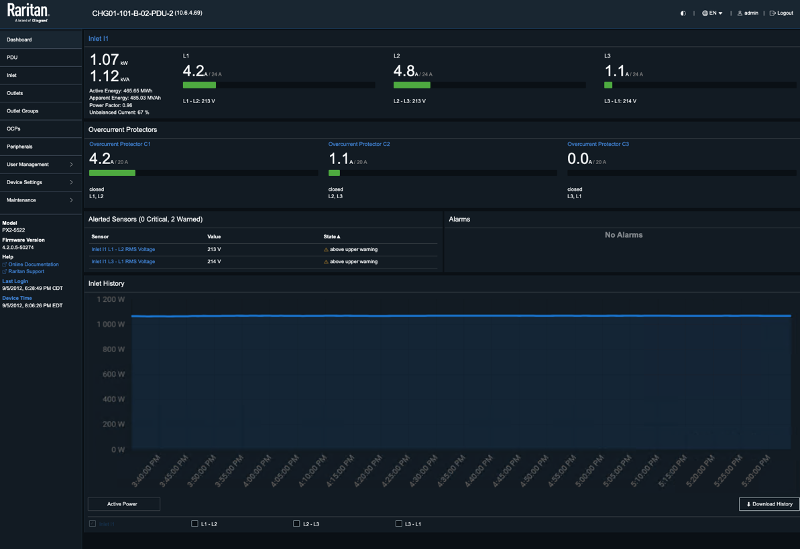
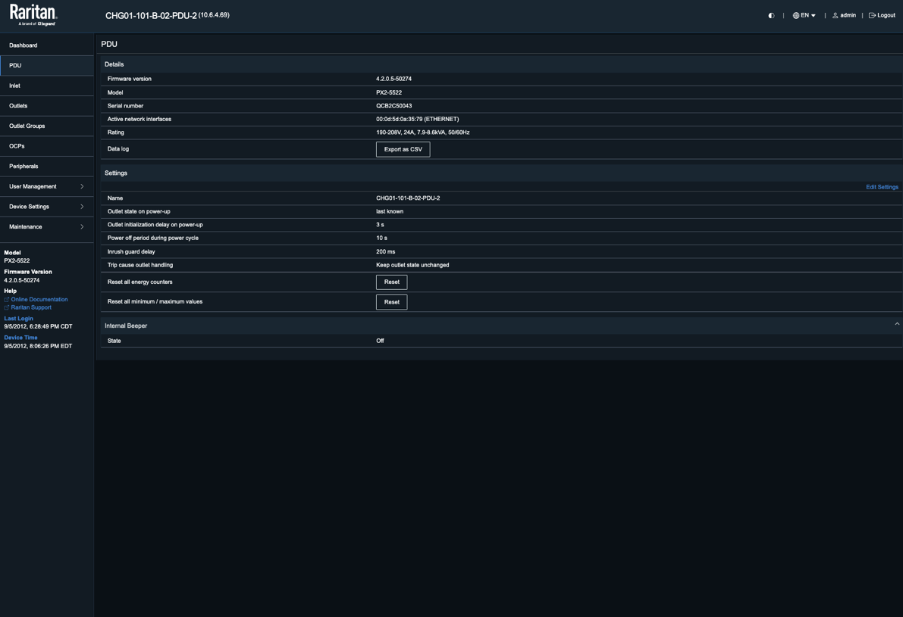
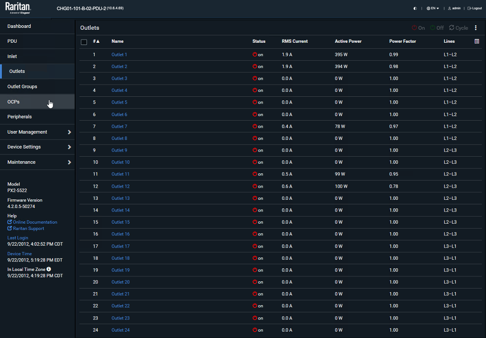

# Scenario 1: Navigating Smart PDU Dashboard

**Objective:** Master the navigation of the Smart PDU interface.

**Context:** This exercise provides a guided walkthrough of the Smart PDU interface and the data it exposes for ingestion and analysis within Splunk Cloud.

## Step 1: Access the Smart PDU

Access the Smart PDU Demo portal and log in using the credentials provided below.

| <!-- -->     | <!-- -->                   |
| ------------ | -------------------------- |
| `URL`        | [{{ smart_pdu.url }}]({{ smart_pdu.url }}) |
| `Username`   | {{ smart_pdu.username }}   |
| `Password`   | {{ smart_pdu.password }}   |

## Step 2: Explore the Raritan Dashboard

The Raritan dashboard provides comprehensive real-time and historical monitoring of smart PDU power usage, including three-phase load balancing and outlet-level tracking, to facilitate data center optimization and trend analysis.

<figure markdown>
  
</figure>

## Step 3: Review PDU Device Information

The **PDU** tab in the Raritan interface serves as a centralized dashboard for monitoring critical device information, such as the model and firmware version.

<figure markdown>
  
</figure>

## Step 4: Inspect Outlet-Level Metrics

The **Outlets** tab enables granular power management by providing real-time visibility into individual outlet status and key metrics, including RMS current (Amps), active power (Watts), power factor, and phase line assignment.

<figure markdown>
  
</figure>

## Result

You have explored the smart PDU interface and identified the critical power metrics available for ingestion and analysis within Splunk Cloud.

---
