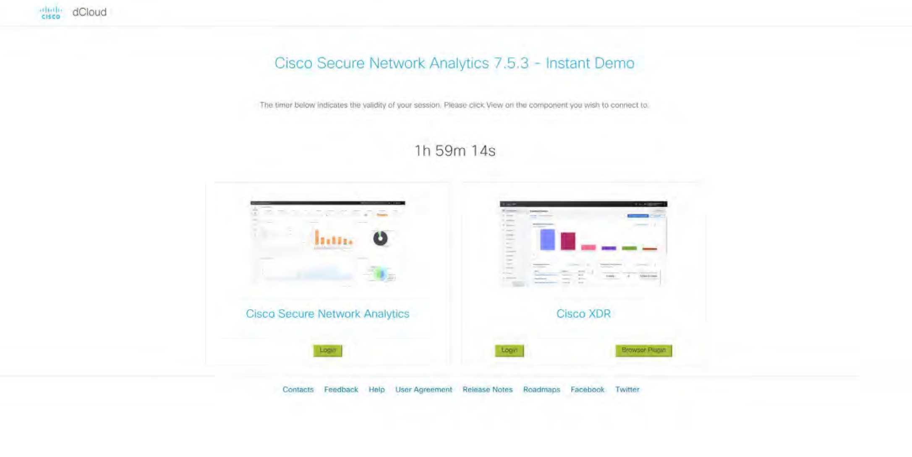
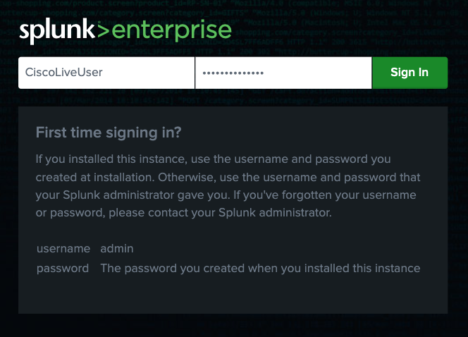
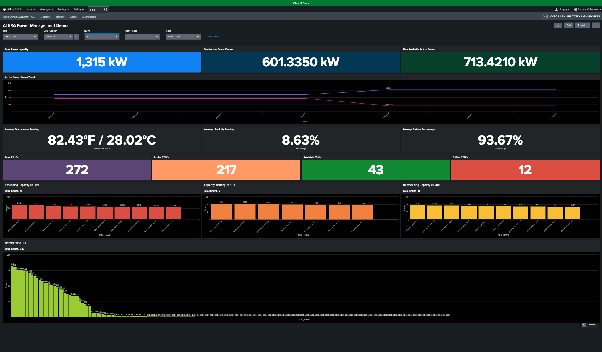

# Scenario 2: Navigating Splunk Cloud Dashboard

**Objective:** Master the navigation and functionality of the Splunk Cloud Dashboard to monitor your Data Center.

**Context:** This exercise provides a guided walkthrough of the interface, designed to help you efficiently locate key features and effectively manage your data views.

## Step 1: Log into Splunk Cloud

On the landing page, click **Cisco Splunk Cloud Login** to navigate to the Splunk Cloud login page.

<figure markdown>
  
</figure>

Log in using the following credentials:

| <!-- -->     | <!-- -->                   |
| ------------ | -------------------------- |
| `Username`   | {{ splunk.username }}      |
| `Password`   | {{ splunk.password }}      |

<figure markdown>
  
</figure>

## Step 2: Apply Dashboard Filters

Refine your data view by utilizing the filter controls located at the top of the interface. You can drill down into specific datasets by selecting your preferred options for **Site**, **Data Center**, **Row**, **Hostname**, and **Time Range**.

<figure markdown>
  
</figure>

## Step 3: Observe Dynamic Data Updates

As you refine your filters, the data values in the dashboard panels will update according to your selection, including power capacity, active power draw, environmental readings, and PDU status counts.

## Result

You have successfully mastered the login process and the application of primary filtering tools to effectively analyze data across your Data Center environment.

---