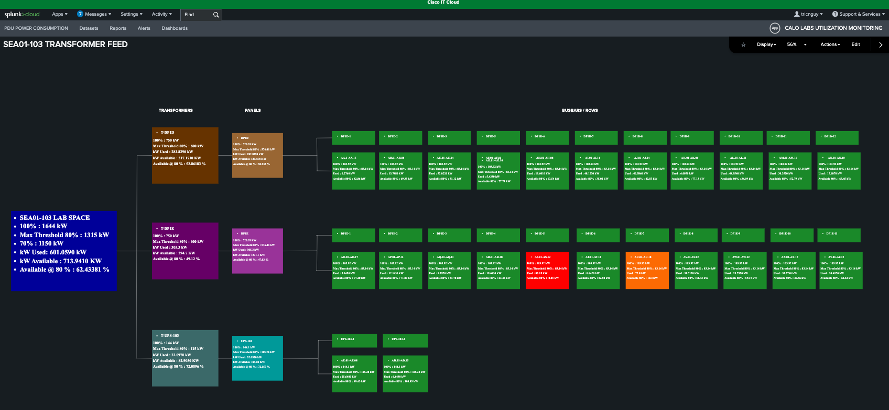

# Scenario 3: Data Center Power Infrastructure: Capacity and Topology Analysis

**Objective:** Gain proficiency in monitoring and interpreting data center power metrics, including capacity thresholds, real-time consumption, and available power headroom.

**Context:** This exercise provides a comprehensive view of your data center's power infrastructure. You will learn to navigate the dashboard to identify key performance indicators (KPIs), such as total power capacity (calibrated at 80% utilization for optimal safety), current active power draw, and remaining power headroom. Additionally, you will explore the power flow visualization tools to trace energy distribution from the primary utility source down to the individual rack level, enabling proactive capacity planning and load management.

## Step 1: Monitor Power Capacity and Trends

Select a data center to monitor its total power capacity (at 80%), active power draw, and available headroom. The seven-day trend analysis provides key insights into historical power consumption.

<figure markdown>
  
</figure>

## Step 2: Open the Power Flow Topology

Visualize the data center's power flow topology by selecting the **Total Active Power** metric.

<figure markdown>
  
</figure>

## Step 3: Explore the Transformer-to-Rack Map

This dashboard maps power flow from transformers to racks, providing the visibility needed to identify high-load areas and optimize power distribution across the data center.

<figure markdown>
  
</figure>

## Step 4: Review Row-Level Power Consumption

On the far right of the topology view, you can monitor the power consumption and capacity of each row.

## Step 5: Interpret Capacity Alerts

Capacity status is monitored via color-coded alerts to ensure adherence to the **80% NEC 220.87 threshold**. Zoom into the topology map to examine specific rows. If rows like AS1–AS12 or AU1–AU18 approach capacity, engineers should relocate devices to rows with sufficient power headroom.

!!! warning
    Rows highlighted in **red** or **orange** indicate they are at or approaching the 80% capacity threshold and require immediate attention.

## Step 6: Monitor Transformer and Panel Capacity

Review transformer and panel capacity to optimize power delivery to each busway.

## Result

You have learned to monitor data center power flow infrastructure, identify high-consumption rows, and implement strategies to effectively balance power loads.

___