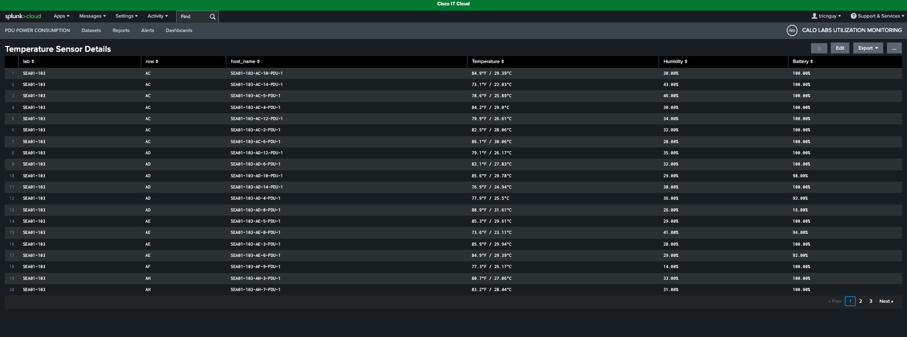
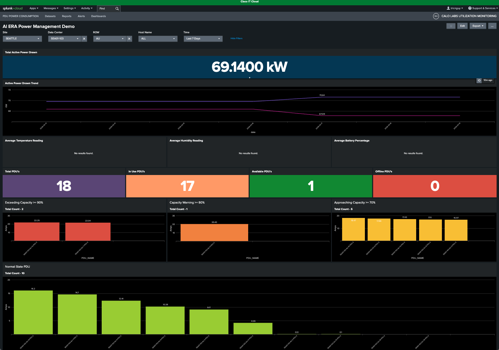

# Scenario 4: Data Center Environmental Monitoring and Temperature Analysis

**Objective:** Provide real-time visibility into the data center's thermal environment, enabling proactive monitoring of temperature trends to ensure optimal equipment performance and prevent hardware failure.

**Context:** To ensure optimal data center performance and energy efficiency, this dashboard aggregates data from Cisco Meraki MT10 sensors into Splunk. By mapping these sensors to their corresponding rack PDUs, it provides a consolidated view of temperature, humidity, and battery health, enabling proactive identification of thermal hotspots and informed climate control optimization.

## Step 1: Review Environmental Summary Panels

The three summary panels at the top display the **average temperature**, **humidity**, and **battery status** of the data center's Meraki sensors.

<figure markdown>
  
</figure>

## Step 2: Drill into Temperature Sensor Details

Select the **Average Temperature** panel to view a detailed breakdown of all data center sensors and their current readings.

<figure markdown>
  
</figure>

## Step 3: Navigate the Sensor Report

This report summarizes all sensor data, including temperature, humidity, and battery levels. Each page displays 20 sensors; use the **pagination controls** at the bottom right to navigate the list.

<figure markdown>
  
</figure>

## Step 4: Handle Missing Sensor Data

When you select a Row that does not have sensors installed, the temperature and humidity panels will display "No results found." This is expected behavior.

<figure markdown>
  
</figure>

## Result

You can now effectively monitor data center environmental conditions and retrieve comprehensive sensor status reports.
