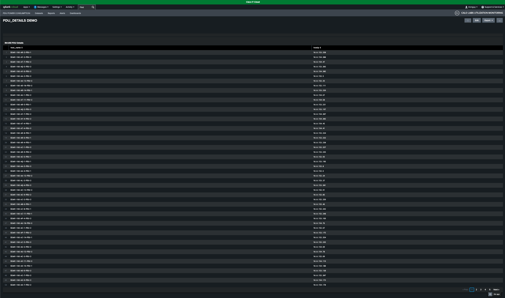
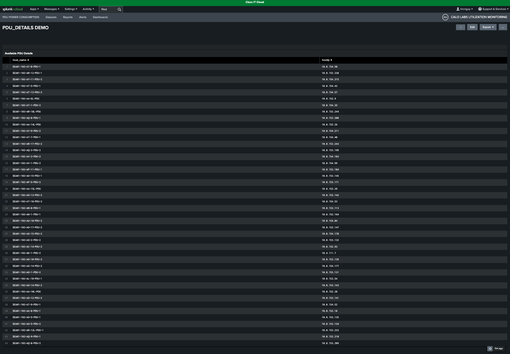
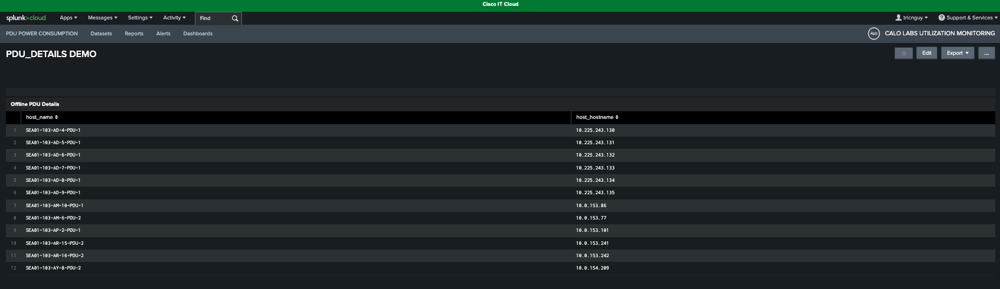

# Scenario 5: PDU Operational Status and Availability Tracking

**Objective:** Gain proficiency in monitoring PDU operational health, tracking inventory status, and identifying power management opportunities across the data center.

**Context:** This exercise provides a comprehensive overview of PDU fleet status. You will learn to distinguish between in-use, available, and offline PDUs and retrieve detailed inventory reports for each category.

## Step 1: Review the PDU Status Summary

The Seattle (SEA01-103) dashboard provides an operational overview of 272 PDUs: **217 in-use**, **43 available**, and **12 offline**. This summary supports efficient power management and helps ensure optimal data center performance.

<figure markdown>
  
</figure>

## Step 2: View In-Use PDUs

Click the **In-Use** value to view a list of all active PDUs.

<figure markdown>
  
</figure>

## Step 3: Navigate the In-Use Report

This report lists active PDUs and their associated host IP addresses. Use the **pagination controls** at the bottom right to navigate; each page displays 50 PDUs.

## Step 4: View Available PDUs

Click the **Available** value to view a list of PDUs that are not currently in use.

<figure markdown>
  
</figure>

## Step 5: Navigate the Available Report

This report lists available PDUs and their associated host IP addresses. Use the pagination controls at the bottom right to navigate.

## Step 6: View Offline PDUs

Click the **Offline** value to view a list of PDUs that are currently offline.

<figure markdown>
  
</figure>

## Step 7: Navigate the Offline Report

This report lists offline PDUs and their associated host IP addresses. Use the pagination controls at the bottom right to navigate.

## Result

By following these steps, you can now effectively monitor PDU health and access detailed inventory data, ensuring efficient power management throughout your data center.

---