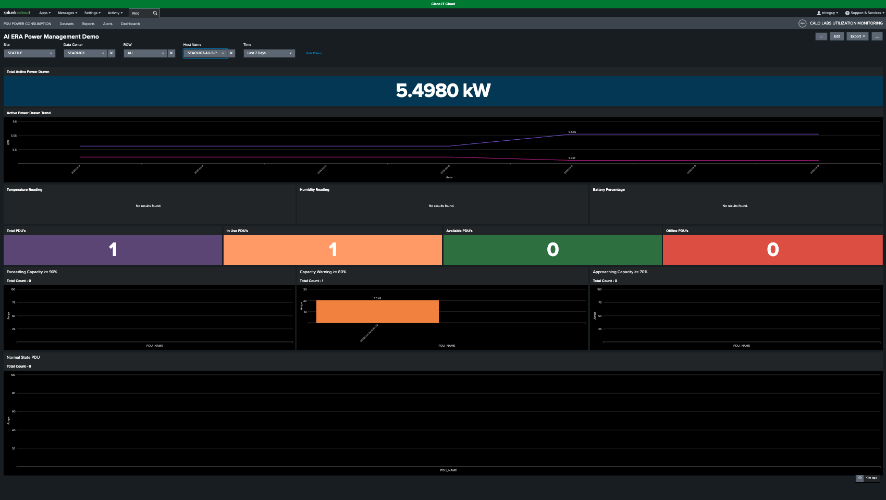
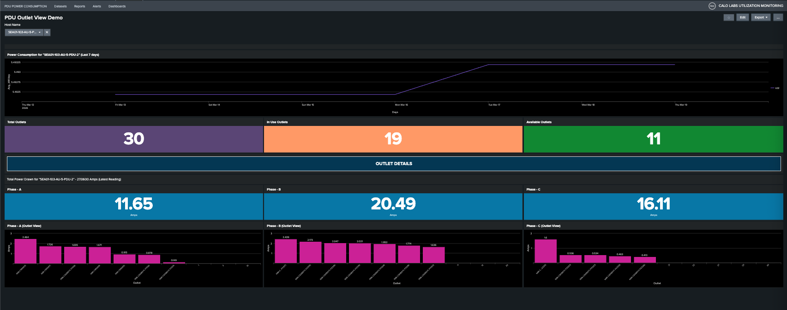
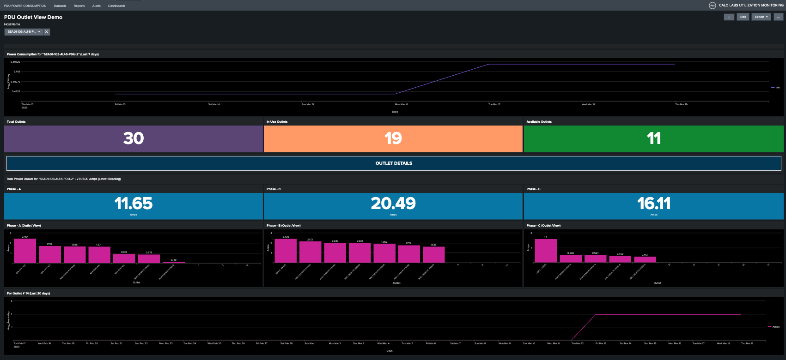

# Scenario 6: PDU Outlet View and Phase Balancing

**Objective:** Analyze PDU power distribution, monitor outlet utilization, and evaluate phase-level load balancing using the PDU Outlet View dashboard.

**Context:** This exercise provides a granular view of PDU power consumption and infrastructure health. By examining phase-specific metrics (Phase A, B, and C) and individual outlet usage, you will learn to identify load imbalances, track active versus available capacity, and optimize power distribution across your data center environment.

## Step 1: Select a PDU for Detailed View

From the main dashboard, select a PDU to open its Outlet View. For this exercise, select PDU **SEA01-103-AU-5-PDU-2**.

<figure markdown>
  
</figure>

## Step 2: Review the PDU Outlet View Dashboard

The PDU Outlet View dashboard displays granular power metrics for the selected PDU.

<figure markdown>
  
</figure>

## Step 3: Analyze Power Consumption Trend

The top panel displays the **power consumption trend** for the selected PDU over the last seven days.

## Step 4: Review Outlet Status Summary

The **Total**, **In-Use**, and **Available** panels provide the current operational status of the selected PDU, detailing total capacity, active connections, and remaining availability.

## Step 5: Examine Phase-Level Outlet Details

The **Outlet Details** section organizes outlets by phase group, depending on the PDU's phase configuration. Monitoring these groups is critical for load balancing, as it helps prevent phase overloads and potential breaker trips.

!!! warning
    Unbalanced phase loads can cause breaker trips. Ensure power consumption is distributed as evenly as possible across Phase A, Phase B, and Phase C.

## Step 6: Identify Devices Mapped to Outlets

Each phase group identifies the devices mapped to specific outlets.

!!! note
    To ensure this data is retrieved via SNMP, you must first map devices to PDU outlets within the Smart PDU GUI.

## Step 7: View Outlet Historical Trend

Selecting an outlet displays a new panel at the bottom, providing **historical trend data** for that specific outlet.

<figure markdown>
  
</figure>

## Result

Well Done! You have successfully mastered the PDU Outlet View dashboard, enabling you to perform comprehensive power analysis, balance phase loads, and troubleshoot device-level consumption to ensure optimal data center performance.

---