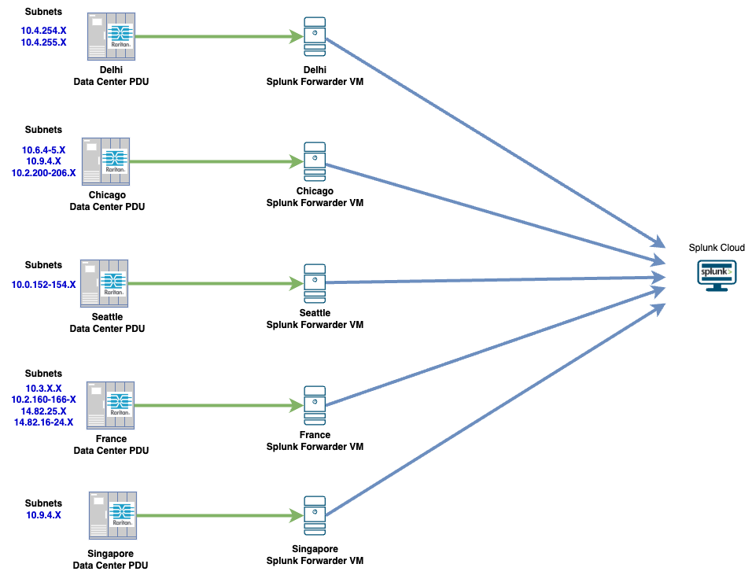

# Overview

## AI Era Data Center Power Management Dashboard

This lab guides engineers through the implementation of Smart PDUs to achieve granular, real-time visibility into power consumption and management across the data center.

## Scenario: Unified Power Management Across Distributed Data Centers

As a Senior Engineer at Data Pac Networks, your task would be to execute a comprehensive power and thermal readiness audit across six global sites — SEA01-103, CHG01-101, CHG01-102, DEL01-102, FRA01-104, and SGP01-04 — within a 45-minute maintenance window to ensure 100% uptime while scaling infrastructure for high-density AI server deployments.

You will leverage the AI Era Data Center Power Management Dashboard to conduct a high-level load distribution review, verifying that all PDU power loads remain within optimal operating thresholds and identifying any racks exhibiting significant phase variance or overload risk.

Your primary focus will be the **SEA01-103** data center for general capacity and thermal validation, followed by a targeted deep-dive investigation into **CHG01-101**. For CHG01-101, you are required to utilize the Smart PDU native GUI to visualize phase-load imbalances, perform granular outlet-level analysis, and formulate a formal load-shunting remediation strategy including the migration of low-power devices to maximize PDU capacity and ensure the facility is fully prepared for incoming AI-compute hardware.

<figure markdown>
  
  <figcaption>Data Pac Networks: PDU-to-Splunk Ingestion Workflow</figcaption>
</figure>

## Learning Objectives

Upon completion of this lab, you will be able to:


- {{ obj }}


!!! tip "Quick Notes"
    ## What is a Smart PDU?

    - **Intelligent Power Distribution:** Unlike standard PDUs, a Smart PDU provides real-time telemetry and remote management capabilities for power distribution at the rack level.
    - **Remote Monitoring:** It tracks critical metrics such as voltage, current (Amps), power factor, and kilowatt-hour (kWh) consumption.
    - **Remote Control:** It allows engineers to remotely cycle power to individual outlets, facilitating hard reboots of unresponsive equipment without physical intervention.
    - **Alerting:** It provides proactive notifications when power thresholds are exceeded, preventing potential circuit overloads.

    ## Visibility into Power Utilization Solves Three Critical Problems

    - **Capacity Planning:** It prevents overloading circuits by identifying available headroom, ensuring that new hardware can be deployed safely without tripping breakers.
    - **Operational Efficiency:** It helps identify "zombie" servers or inefficient hardware, allowing for better Power Usage Effectiveness (PUE) and reduced operational costs.
    - **Fault Detection:** It enables rapid identification of power anomalies — such as phase imbalances or failing power supplies — before they result in unplanned downtime.

    ## Why Use Splunk?

    - **Centralized Aggregation:** Splunk acts as a single pane of glass, collecting SNMP traps and polling data from thousands of PDUs across global sites into one unified platform.
    - **Historical Analysis:** Splunk provides long term retention period which will help data center operators understand the power usage and trends to make informed decision..
    - **Robust Alerting:** Splunk's powerful query language allows for custom, complex alerting rules help identify and mitigate issues faster.

!!! note
    The smart PDU infrastructure and the AI Era Power Management Dashboard are fully provisioned and integrated for this environment. No initial configuration is required; you may proceed directly to the assessment and monitoring tasks.

## Tasks
To gain hands-on experience, progress through the following tasks:

1. [Validate SEA01-103 Electrical and Cooling Readiness for 300kW AI Deployment](task01.md)
2. [Audit PDU Load Distribution and Formulate Remediation Strategy for SEA01-103](task02.md)
3. [Visualize PDU Capacity and Phase imbalance for CHG01-101 AI Readiness](task03.md)
4. [Run Python Script to Query Splunk Data](task04.md)

<!-- ## Getting Started: Access Requirements
### Connectivity and Hardware

- **Network Access:** All lab dashboards are hosted on the public network. Please ensure you have a stable internet connection for the duration of the session.
- **Recommended Hardware:** A laptop or tablet is recommended to ensure full compatibility and optimal interaction with the dashboard interfaces. -->

!!! info "Disclaimer"
    This training document is intended to familiarize participants with Smart PDU power visibility, Splunk dashboard analysis, and basic data center power and cooling validation workflows. The lab design, data, and configuration examples have been adjusted to support the learning objectives of the lab and do not represent a production-ready or fully optimized data center design. As a result, not all recommended features,thresholds, or operational practices may be implemented exactly as they would be in a live deployment. For design-specific guidance or production deployment questions, please contact your Cisco representative.