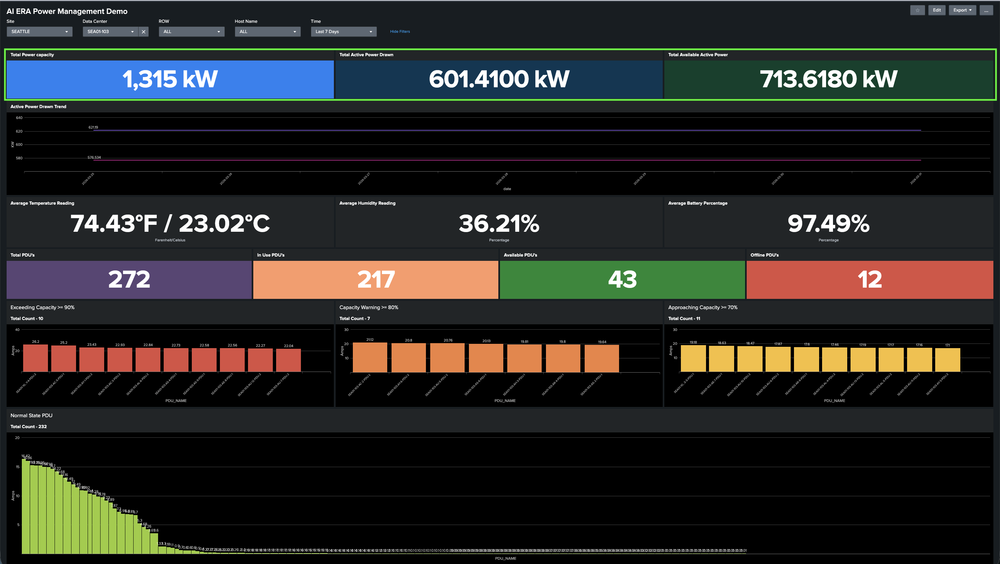
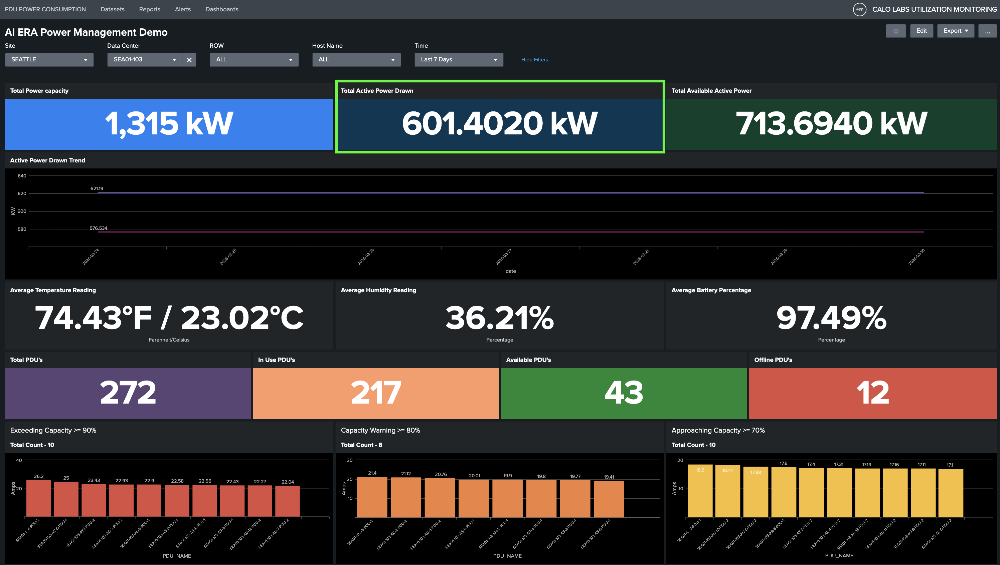
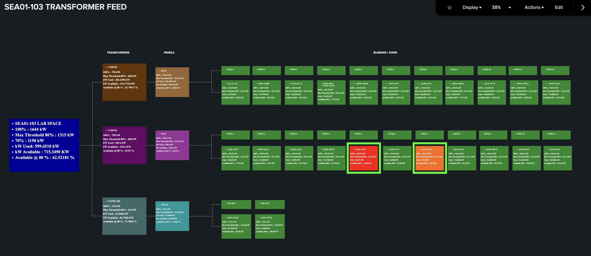
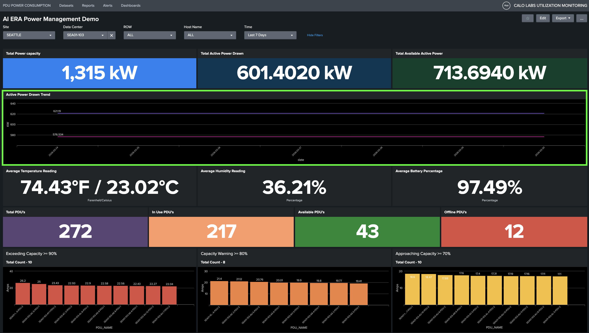
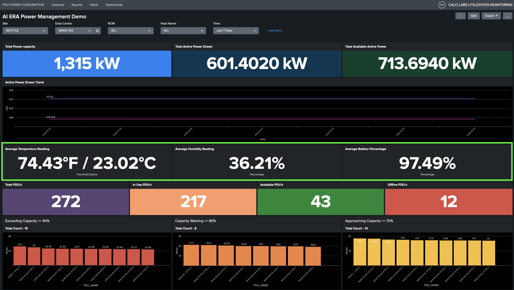
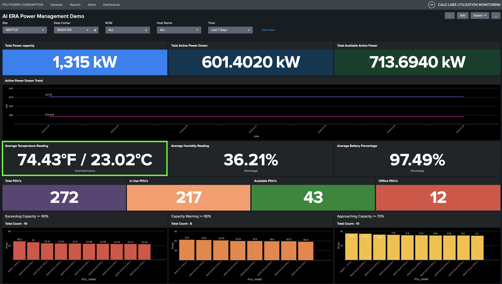
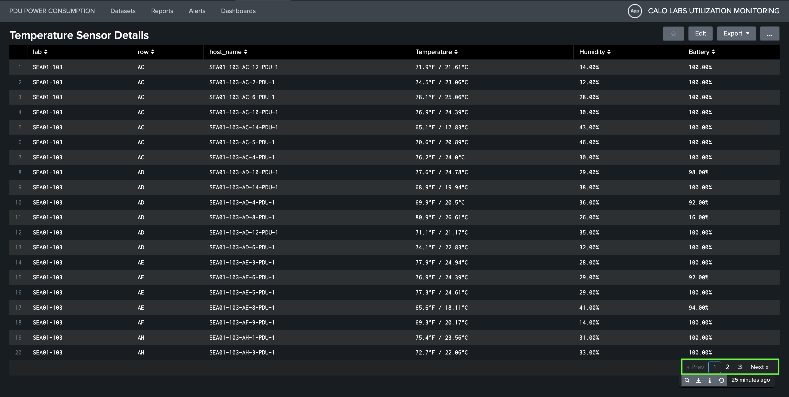

# Task 1: Validate DC SEA01-103 Power and Cooling capacity for 300kW AI Deployment

**Objective:** Evaluate the electrical and cooling capacity for SEA01-103 Data Center to support a 300kW high-density AI server deployment. Given the intensive power requirements of modern AI workloads, this assessment is critical to validate that our existing infrastructure can sustain this load without compromising our 100% uptime commitment.

## Step 1: Accessing the AI Era Power Management Dashboard
To ensure best experience and consistent performance during your lab, please follow the instructions for dashboard access:

- Use Chrome browser to access the Splunk "AI Era Power Management Demo" Dashboard to ensure optimal dashboard functionality and system stability.
- Click on the link below to login into the dashboard using the following credentials:

| <!-- -->     | <!-- -->                   |
| ------------ | -------------------------- |
| `URL`        | [Splunk Dashboard: AI Era Power Management Demo]({{ splunk.url }}){target=_blank} |
| `Username`   | {{ splunk.username }}      |
| `Password`   | {{ splunk.password }}      |

## Step 2: Check the Total Power Capacity for Seattle Site — SEA01-103 Data Center

Please utilize the global filter - Select **Seattle** site and the **SEA01-131** Data Center.
Ensure the page is fully loaded before proceeding with the power and cooling assessment to guarantee the accuracy of your data.

<figure markdown>
  
  <!-- <figcaption>AI Era Power Management Dashboard(SEA01-103)</figcaption> -->
</figure>

### Power Capacity Analysis: SEA01-103
Now look at the highlighted three panels which provides a real-time power visibility for Data Center SEA01-103:

- **Total Power Capacity:** 1315 kW represents 80% of the total rated load, serving as the optimal safety threshold for the facility.
- **Total Active Power Drawn:** 601 kW (45.7%) shows the current power consumption of the Data Center.
- **Total Available Active Power:** 713 kW (54.2%) indicates the remaining power available for additional equipment deployment.
<!-- - **Current Utilization**: 45.71% -->

<figure markdown>
  
  <!-- <figcaption>AI Era Power Management Dashboard(SEA01-103)</figcaption> -->
</figure>

<!-- Based on the current dashboard metrics for the SEA01-103 Data Center, the power profile is as follows:

| Metric                      | Value         |
| --------------------------- | ------------- |
| Total Power Capacity        | 1,315 kW      |
| Current Power Load          | 601.1070 kW   |
| Available Power Headroom    | 713.8210 kW   |
| Current Utilization         | 45.71%        | -->

To visualize the power distribution topology for the Smart PDUs, click the highlighted Total Active Power Drawn

<figure markdown>
  
</figure>

This view provides power-feed granularity from the utility source through the transformer feed, bus bars/panels, rows, and racks.

<figure markdown>
  
  <!-- <figcaption>SEA01-103 Transformer Feed — Power Flow Topology</figcaption> -->
</figure>

This topology dashboard serves as a critical real-time heatmap for our power distribution, providing clear visibility into real time power consumption.

- **Critical Alerts (Red Tiles):** Indicates that the PDU inside the Data Center have exceeding the 80% threshold indicating
immediate remediation, like device migration or the decommissioning of unused hardware, to mitigate overload/power outage
risks.
- **Warning Indicators (Orange Tiles):** Denotes racks approaching capacity limits, necessitating pre-emptive load management.
- **Optimal Capacity (Green Tiles):** Identifies racks with sufficient headroom for new equipment addition.

Then, switch to the main dashboard tab that is already open and look for the highlighted Active Power Drawn panel shown below. This panel displays the historical load trend over the past seven days

<figure markdown>
  
  <!-- <figcaption>AI Era Power Management Dashboard(SEA01-103)</figcaption> -->
</figure>

With this analysis, we have confirmed that the SEA01-103 Data Center has sufficient electrical capacity to support the proposed 300 kW AI server deployment, with 713.82 kW of available headroom. By cross-referencing the load distribution with the topology heatmap, we can strategically place these workloads in “green” racks to achieve optimal power distribution and better load balancing.
This data-driven approach enables us to scale our AI capabilities while maintaining our commitment to 100% uptime and operational
stability.

## Step 3: Validate Cooling Compliance for AI Infrastructure in SEA01-103

The objective is to monitor environmental conditions inside the Data Center to ensure cooling is operating effectively. Meraki M10 sensors have been deployed throughout the Data Center to provide visibility into temperature, humidity, and sensor battery status.
Review the highlighted average values for temperature, humidity, and battery levels from all sensors to evaluate the general environmental state.

<figure markdown>
  
  <!-- <figcaption>AI Era Power Management Dashboard(SEA01-103)</figcaption> -->
</figure>

Click the temperature value to view the list of sensors in the Data Center and to assess temperature and humidity across the entire Data Center, including each row or rack.

<figure markdown>
  
  <!-- <figcaption>AI Era Power Management Dashboard(SEA01-103)</figcaption> -->
</figure>

Click the page numbers or the Next button located at the bottom right as highlighted below to view the complete list of temperature sensors.

<figure markdown>
  
</figure>

<!-- !!! info "Thermal Compliance" -->
Current telemetry confirms that ambient temperatures for SEA01-103 Data Center are within the optimal range. To ensure peak performance and hardware longevity, the environment must be maintained between **64°F and 80°F (18°C–27°C)**.

Proactive management of cooling  conditions helps Data Center operators maintain reliable operations, prevent hardware throttling, and reduce equipment failure risks.

## Result

<!-- !!! success "Capacity Summary" -->
<!-- Based on current power availability and thermal performance metrics, location **SEA01-103** is verified as capable of supporting a **300kW AI server load deployment**. -->
Based on current power and cooling availability metrics, location **SEA01-103** is verified as capable of supporting a **300kW AI server load deployment**. 

---
