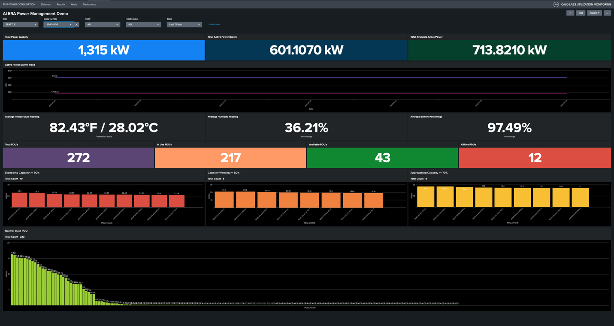
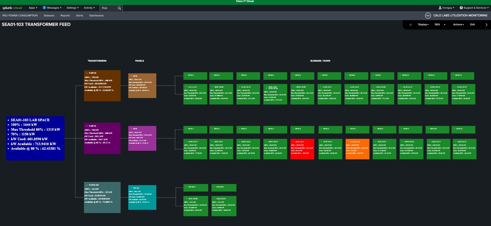
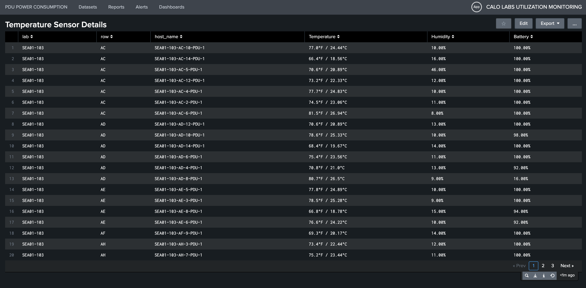

# Task 1: Validate SEA01-103 Electrical and Thermal Readiness for 300kW AI Deployment

**Objective:** Evaluate the electrical and thermal capacity of the SEA01-103 data center to support a 300kW high-density AI server deployment. Given the intensive power requirements of modern AI workloads, this assessment is critical to validating that our existing infrastructure can sustain this load without compromising our 100% uptime commitment.

## Step 1: Check the Total Power Capacity for Seattle Site — SEA01-103

Login to the AI Era Power Management Dashboard, utilize the global filter to select the **Seattle** site and the **SEA01-103** data center. Ensure the view is fully loaded before proceeding with the power and thermal assessment to guarantee the accuracy of your data.

<figure markdown>
  
</figure>

The following three panels provide a real-time overview of the data center's power profile:

- **Total Power Capacity:** Represents 80% of the total rated load, serving as the optimal safety threshold for the facility.
- **Total Active Power Drawn:** Displays the current aggregate power consumption of the data center.
- **Total Available Active Power:** Indicates the remaining power headroom available for additional equipment deployment.

### Power Utilization Analysis: SEA01-103

Based on the current dashboard metrics for the SEA01-103 data center, the power profile is as follows:

| Metric                      | Value         |
| --------------------------- | ------------- |
| Total Power Capacity        | 1,315 kW      |
| Current Power Load          | 601.1070 kW   |
| Available Power Headroom    | 713.8210 kW   |
| Current Utilization         | 45.71%        |

To visualize the power distribution topology for the Smart PDUs, click the metric value displayed under **Total Active Power Drawn**.

<figure markdown>
  
  <figcaption>SEA01-103 Transformer Feed — Power Flow Topology</figcaption>
</figure>

The topology dashboard serves as a critical real-time heatmap for our power distribution, providing clear visibility into the health of our electrical infrastructure:

- **Critical Alerts (Red Tiles):** Indicates PDU utilization exceeding the 80% threshold. Immediate remediation — including device migration or the decommissioning of idle hardware — is required to mitigate overload risks.
- **Warning Indicators (Orange Tiles):** Denotes racks approaching capacity limits, necessitating pre-emptive load management.
- **Optimal Capacity (Green Tiles):** Identifies racks with sufficient headroom for high-density integration.

Going back to the main dashboard, the **Active Power Drawn Trend** panel displays historical load data from the past seven days.

!!! success "Capacity Verification"
    The SEA01-103 data center is confirmed to have sufficient electrical capacity, with **713.82 kW** of available headroom, to support the proposed 300 kW AI server deployment. By cross-referencing our current load distribution with the topology heatmap, we can strategically allocate these workloads to "Green" racks, ensuring optimal power distribution and load balancing.

## Step 2: Validate Thermal Compliance for AI Infrastructure in SEA01-103

Monitor data center health by reviewing average temperature, humidity, and battery readings across all sensors.

Click on the **temperature value** to view the list of sensors in the data center to see the temperature, humidity, and their battery level.

<figure markdown>
  
</figure>

Click the page numbers or the **Next** button located at the bottom right of the interface to navigate through the complete list of temperature sensors.

!!! info "Thermal Compliance"
    Current telemetry confirms that ambient temperatures within the lab are within the optimal range for high-density AI hardware. To ensure peak performance and hardware longevity, the environment must be maintained between **64°F and 80°F (18°C–27°C)**. Proactive management of these thermal parameters is essential to prevent hardware throttling, mitigate equipment failure risks, and ensure the long-term reliability of our AI infrastructure.

## Result

!!! success "Capacity Summary"
    Based on current power availability and thermal performance metrics, location **SEA01-103** is verified as capable of supporting a **300kW AI server load**.

---
