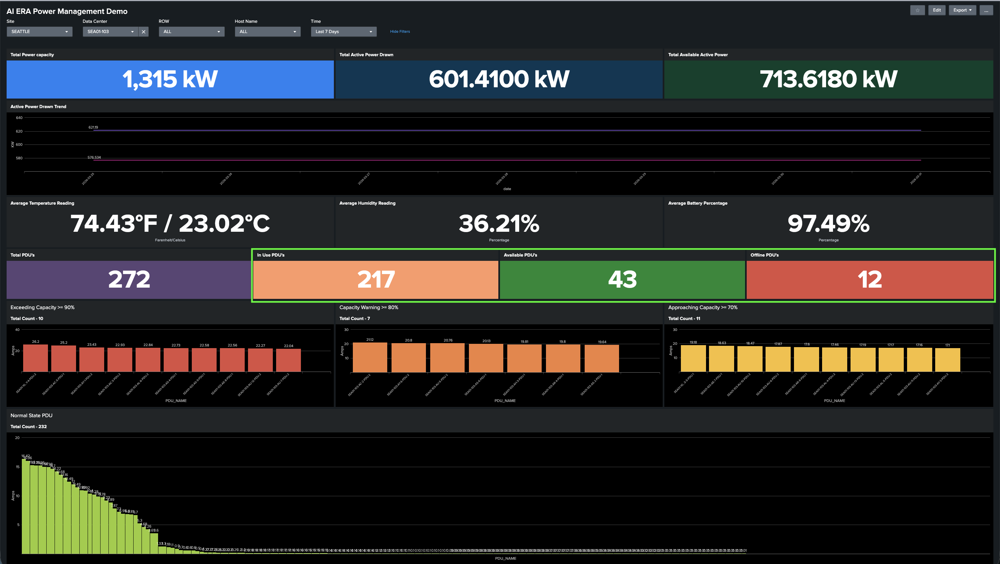
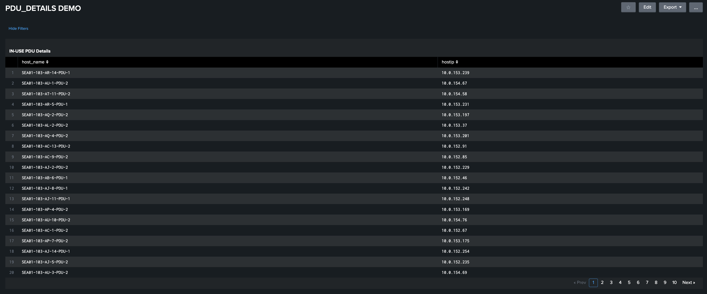
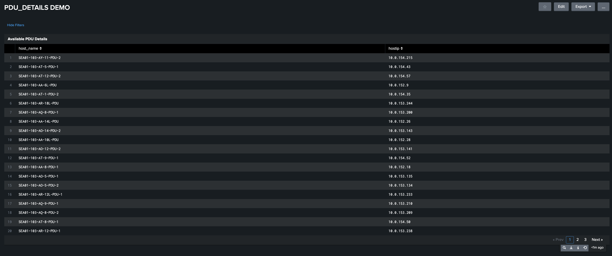
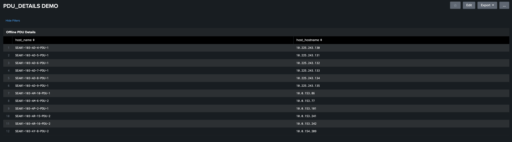
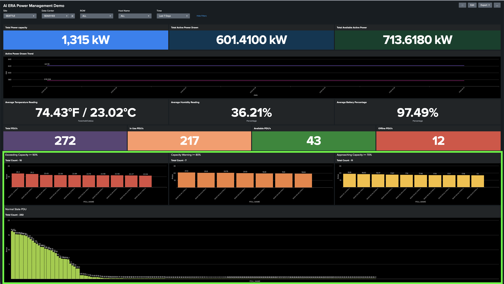
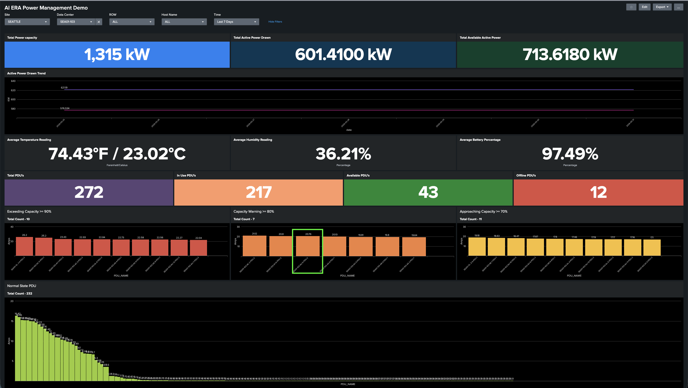
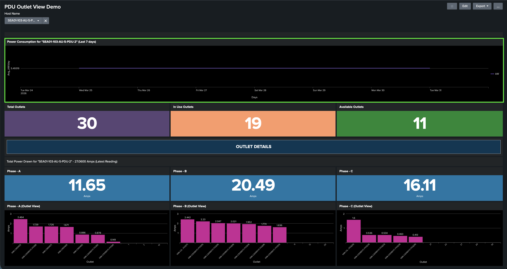
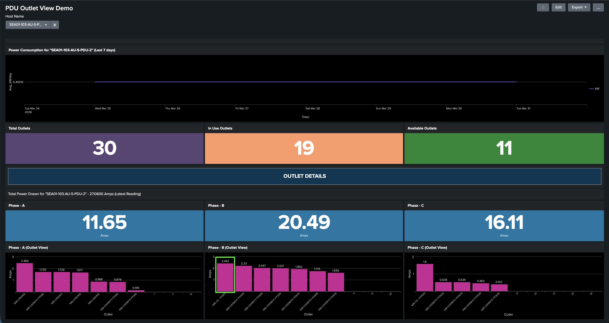
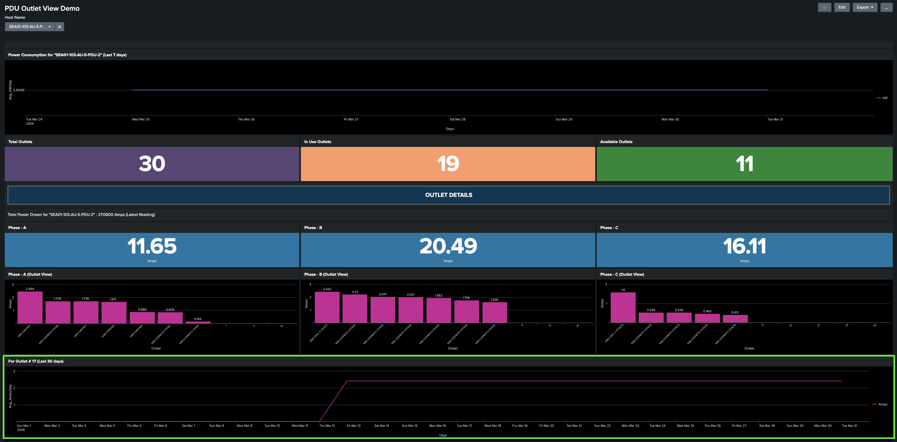

# Task 2: Audit PDU Load Distribution and Formulate Remediation Strategy for SEA01-103

**Objective:** Conduct a comprehensive audit of PDU phase load distribution within the SEA01-103 data center to identify and rectify significant imbalances. Proactive load management is critical to maintaining operational resilience, mitigating the risk of unplanned power outages, and preventing network downtime. This assessment will utilize **SEA01-103-AU-5-PDU-2** as the primary reference case for establishing standardized remediation protocols.

## Step 1: Examine the AI Era Power Management Dashboard PDU Section

The highlighted panel provides an operational summary of SEA01-103 data center PDUs, grouped by status: Total, Active, Available, and
Offline.

**PDU Inventory Summary:**
Now, switch tab to the main dashboard, look for the Total, In-use, Available and offline PDU’s
The dashboard reports a total of 272 PDUs within the data center, with the following status breakdown:

| Status         | Count |
| -------------- | ----- |
| Total PDUs     | 272   |
| Active PDUs    | 217   |
| Available PDUs | 43    |
| Offline PDUs   | 12    |

!!! note
    As these are smart PDUs, stable network connectivity is required to ensure continuous data transmission and real-time monitoring.

<figure markdown>
  
</figure>

To view the full list of PDUs for a specific category, click on the corresponding value—217, 43, or 12.

- **In-Use PDUs:** Click the number 217 to view In-use PDUs:.

<figure markdown>
  
</figure>

- **Available PDUs:** Click the number 43 to view Available PDUs: 

<figure markdown>
  
</figure>

- **Offline PDUs:** Click the number 12 to view Offline PDUs.

<figure markdown>
  
</figure>

## Step 2: Examine the SEA01-103-AU-5-PDU-2 to see if the phase is load balanced

This panel provides real-time visibility into the current amperage drawn for all PDUs in the lab. Use the following status indicators to monitor PDU load and identify PDUs at risk of overloading:

| Status                        | Threshold  |
| ----------------------------- | ---------- |
| :red_circle: Critical         | ≥ 90% load |
| :orange_circle: Warning       | ≥ 80% load |
| :yellow_circle: Caution       | ≥ 70% load |
| :green_circle: Normal         | < 70% load |

<figure markdown>
  
</figure>

Click on the **orange bar graph** for **SEA01-103-AU-5-PDU-2** in the Capacity Warning ≥ 80% panel.

<figure markdown>
  
</figure>

When it is clicked, you will see the Power Consumption for “SEA01-103-AU-5-PDU-2” panel showing the historical power usage in kW
for the last seven days. trend for the last 7 days for this PDU

<figure markdown>
  
</figure>

### PDU Phase Load Analysis
PDU Phase Load Analysis and Remediation Strategy
**Current Load Distribution:**

| Phase          | Current  |
| -------------- | -------- |
| Phase A (L1)   | 11.65 A  |
| Phase B (L2)   | 20.49 A  |
| Phase C (L3)   | 16.11 A  |

<figure markdown>
  
</figure>

!!! note
    The data center maintains an inventory of lab devices and their power mapping details. This information allows us to map each Device PID to its corresponding outlet on the dashboard.

Hover over on the phase B, and click the first bar- outlet 17 and Click to view the outlet and power consumption for **N9k-C93180YC(17)**.

<figure markdown>
  
  <!-- <figcaption>Outlet #17 — Historical trend (last 30 days)</figcaption> -->
</figure>

## Step 3: trategize how we can balance the load for SEA01-103-AU-5-PDU-2

**Analysis:**

The PDU is currently exhibiting a significant phase imbalance. Phase B is carrying a disproportionately high load compared to Phase A, creating an uneven distribution that risks localized thermal stress and potential breaker trips. To maintain optimal electrical efficiency and infrastructure longevity, we must rebalance these phases.

<figure markdown>
  
  <!-- <figcaption>Outlet #17 — Historical trend (last 30 days)</figcaption> -->
</figure>

**Remediation Strategy:**

To achieve phase equilibrium, we will perform a load-shunting procedure:

1. **Identify High-Draw Devices:** Outlet 15 and 17 of Phase B.
2. **Load Migration:** Relocate the power connection for these devices from Phase B to Phase A.
3. **Expected Outcome:** This shift will reduce the current on Phase B (the over-utilized phase) and increase the current on Phase A (the under-utilized phase), bringing all three phases closer to a balanced state.

!!! warning
    Unbalanced phase loads can cause breaker trips. Ensure power consumption is distributed as evenly as possible across Phase A, Phase B, and Phase C.

## Result

You have completed a full audit of PDU load distribution for SEA01-103, identified a significant phase imbalance on AU-5-PDU-2, and formulated a remediation strategy to rebalance the load.

---
