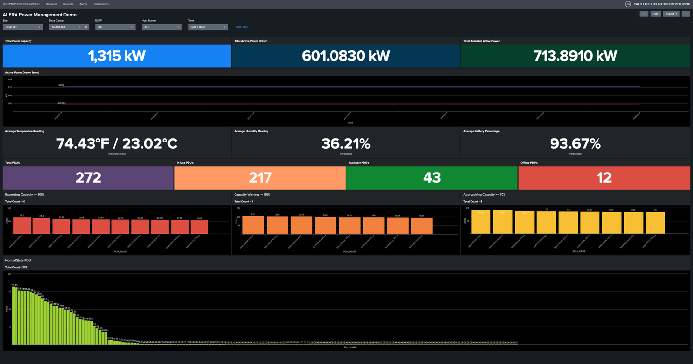
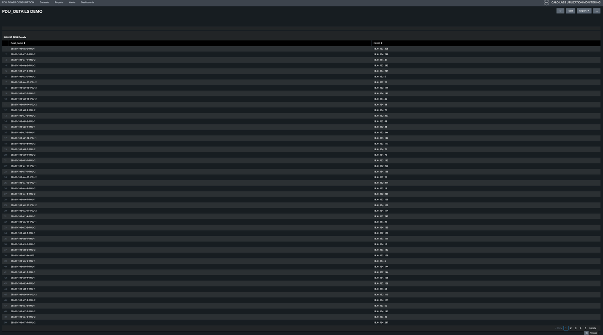
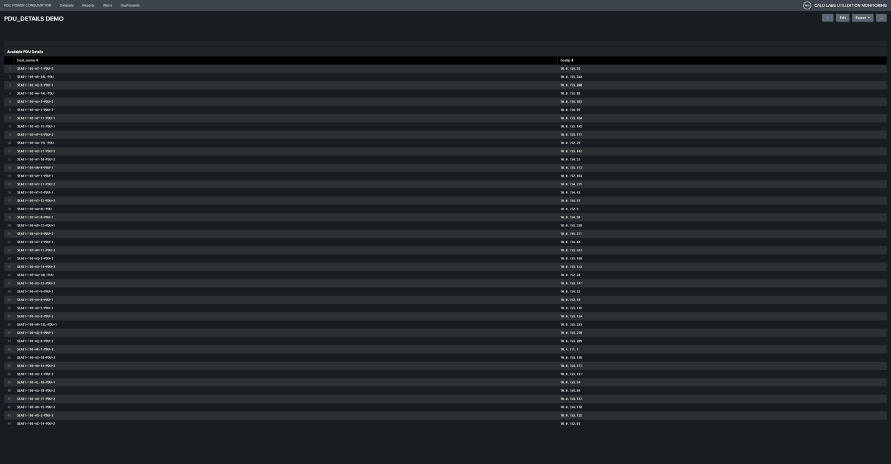
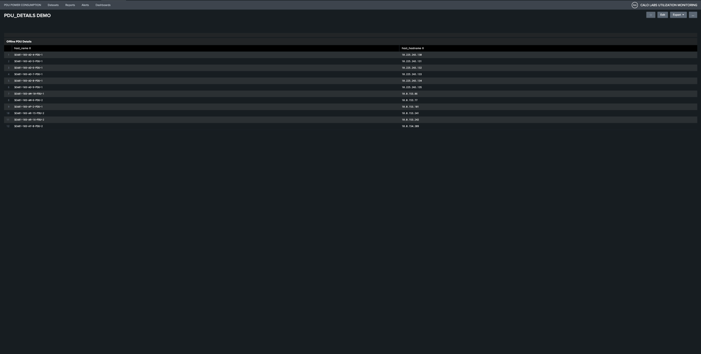
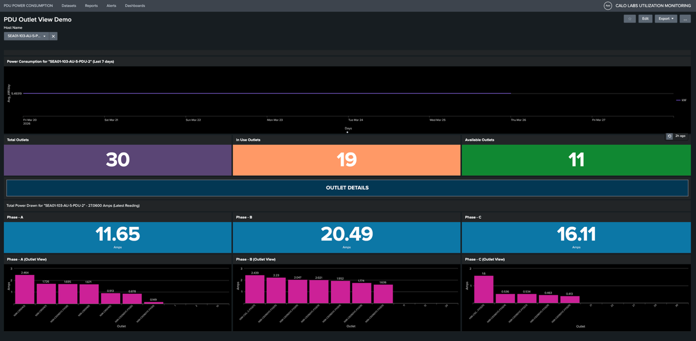
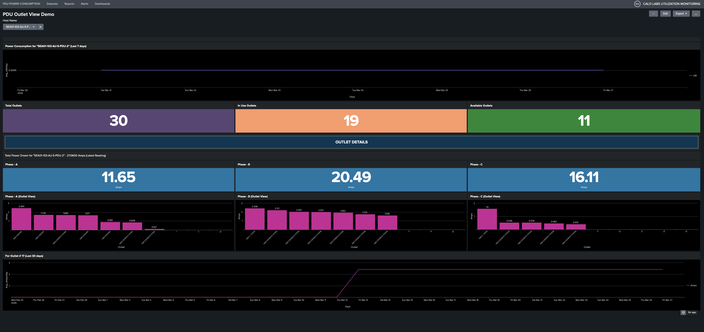

# Task 2: Audit PDU Load Distribution and Formulate Remediation Strategy for SEA01-103

**Objective:** Conduct a comprehensive audit of PDU phase load distribution within the SEA01-103 data center to identify and rectify significant imbalances. Proactive load management is critical to maintaining operational resilience, mitigating the risk of unplanned power outages, and preventing network downtime. This assessment will utilize **SEA01-103-AU-5-PDU-2** as the primary reference case for establishing standardized remediation protocols.

## Step 1: Examine the PDU Section of the Dashboard

This panel provides an operational summary of all lab PDUs, categorizing them by status: Total, Active, Available, and Offline.

**PDU Inventory Summary:**

| Status         | Count |
| -------------- | ----- |
| Total PDUs     | 272   |
| Active PDUs    | 217   |
| Available PDUs | 43    |
| Offline PDUs   | 12    |

!!! note
    As these are smart PDUs, stable network connectivity is required to ensure continuous data transmission and real-time monitoring.

<figure markdown>
  
</figure>

To view a comprehensive list of PDUs by category, select the corresponding value from the dashboard:

- **In-Use PDUs:** Click to view a detailed list of all currently active units.

<figure markdown>
  
</figure>

- **Available PDUs:** Click to view a detailed list of all available units.

<figure markdown>
  
</figure>

- **Offline PDUs:** Click to view a detailed list of all offline units.

<figure markdown>
  
</figure>

## Step 2: Examine SEA01-103-AU-5-PDU-2 Phase Load Balance

This panel provides real-time visibility into the current amperage draw for all PDUs in the lab. Use the following status indicators to monitor load levels and identify PDUs at risk of overloading:

| Status                        | Threshold  |
| ----------------------------- | ---------- |
| :red_circle: Critical         | ≥ 90% load |
| :orange_circle: Warning       | ≥ 80% load |
| :yellow_circle: Caution       | ≥ 70% load |
| :green_circle: Normal         | < 70% load |

Click on the **orange bar graph** for **SEA01-103-AU-5-PDU-2** in the Capacity Warning ≥ 80% panel.

<figure markdown>
  
</figure>

The **Power Consumption for "SEA01-103-AU-5-PDU-2" (Last 7 days)** shows the historical view of kW trend for the last 7 days for this PDU.

### PDU Phase Load Analysis

**Current Load Distribution:**

| Phase          | Current  |
| -------------- | -------- |
| Phase A (L1)   | 11.65 A  |
| Phase B (L2)   | 20.49 A  |
| Phase C (L3)   | 16.11 A  |

!!! note
    The data center maintains an inventory of lab devices and their power mapping details. This information allows us to map each Device PID to its corresponding outlet on the dashboard.

Click on **N9k-C93180YC(17)** to view the outlet trend.

<figure markdown>
  
  <figcaption>Outlet #17 — Historical trend (last 30 days)</figcaption>
</figure>

## Step 3: Strategize Load Balancing for SEA01-103-AU-5-PDU-2

**Analysis:**

The PDU is currently exhibiting a significant phase imbalance. Phase B is carrying a disproportionately high load compared to Phase A, creating an uneven distribution that risks localized thermal stress and potential breaker trips. To maintain optimal electrical efficiency and infrastructure longevity, we must rebalance these phases.

**Remediation Strategy:**

To achieve phase equilibrium, we will perform a load-shunting procedure:

1. **Identify High-Draw Devices:** Outlet 15 and 17 of Phase B.
2. **Load Migration:** Relocate the power connection for these devices from Phase B to Phase A.
3. **Expected Outcome:** This shift will reduce the current on Phase B (the over-utilized phase) and increase the current on Phase A (the under-utilized phase), bringing all three phases closer to a balanced state.

!!! warning
    Unbalanced phase loads can cause breaker trips. Ensure power consumption is distributed as evenly as possible across Phase A, Phase B, and Phase C.

## Result

You have completed a full audit of PDU load distribution for SEA01-103, identified a significant phase imbalance on AU-5-PDU-2, and formulated a remediation strategy to rebalance the load.

---
