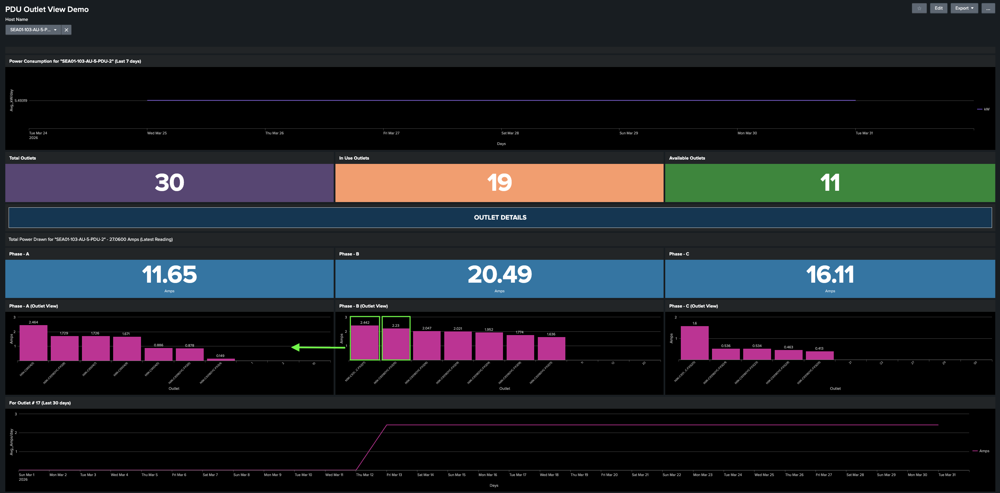

# Task 2: Audit PDU Load Distribution and Formulate Remediation Strategy for SEA01-103

**Objective:** Conduct a comprehensive audit of PDU phase load distribution within the SEA01-103 Data Center to identify and rectify significant imbalances. Proactive load management is critical to maintaining operational resilience, mitigating the risk of unplanned power outages, and preventing network downtime. In this assessment, you will utilize **SEA01-103-AU-5-PDU-2** as the primary reference PDU for establishing standardized remediation protocols.

## Step 1: Examine the AI Era Power Management Dashboard PDU Section

Now, switch to the main dashboard tab that is already open and look for the highlighted panel as shown below. This panel provides an operational summary of the SEA01-103 data center PDUs, grouped by status: Total, Active, Available, and Offline.

<figure markdown>
  
</figure>

**PDU Inventory Summary:**
The data shows a total of 272 PDUs in the data center, with the following status breakdown:

| Status         | Count |
| -------------- | ----- |
| Total PDUs     | 272   |
| Active PDUs    | 217   |
| Available PDUs | 43    |
| Offline PDUs   | 12    |

!!! note
    As these are smart PDUs, stable network connectivity is required to ensure continuous data transmission and real-time monitoring.

To view the full list of PDUs for a specific category, click on the corresponding value: 217, 43, or 12.

- **In-Use PDUs:** Click the number 217 to view In-use PDUs:.

<figure markdown>
  
</figure>

- **Available PDUs:** Click the number 43 to view Available PDUs: 

<figure markdown>
  
</figure>

- **Offline PDUs:** Click the number 12 to view Offline PDUs.

<figure markdown>
  
</figure>

## Step 2: Examine the SEA01-103-AU-5-PDU-2 to check if the phases are load balanced

This panel provides real-time visibility into the current drawn, in amps, for all PDUs in the Data Center. Use the following status indicators to monitor PDU load and identify PDUs at risk of overloading.

| Status                        | Threshold  |
| ----------------------------- | ---------- |
| :red_circle: Critical         | ≥ 90% load |
| :orange_circle: Warning       | ≥ 80% load |
| :yellow_circle: Caution       | ≥ 70% load |
| :green_circle: Normal         | < 70% load |

<figure markdown>
  
</figure>

Click on the **orange bar graph** for **SEA01-103-AU-5-PDU-2** in the Capacity Warning ≥ 80% panel as shown below.

<figure markdown>
  
</figure>

When it is clicked, you will see the Power Consumption for “SEA01-103-AU-5-PDU-2” panel showing the historical power usage in kW
for the last seven days.

<figure markdown>
  
</figure>

### PDU Phase Load Analysis
**Current Load Distribution:**
PDU Phase Load Analysis and Remediation Strategy

| Phase          | Current  |
| -------------- | -------- |
| Phase A (L1)   | 11.65 A  |
| Phase B (L2)   | 20.49 A  |
| Phase C (L3)   | 16.11 A  |

<figure markdown>
  
</figure>

!!! note
    In the Data Center, PDU outlets are mapped to device PIDs, which enables the corresponding PIDs to be displayed on the x-axis.

Hover over on the phase B, and click the first bar - outlet 17 and Click to view the outlet and power consumption for **N9k-C93180YC(17)**.

<figure markdown>
  
  <!-- <figcaption>Outlet #17 — Historical trend (last 30 days)</figcaption> -->
</figure>

Once clicked, the power consumption trend for the selected PID over the past 30 days will be displayed.

<figure markdown>
  
  <!-- <figcaption>Outlet #17 — Historical trend (last 30 days)</figcaption> -->
</figure>

## Step 3: Strategize how we can balance the load for SEA01-103-AU-5-PDU-2

**Analysis:**

The PDU is currently exhibiting a significant phase imbalance. Phase B is carrying a disproportionately high load compared to Phase A, creating an uneven distribution that risks localized thermal stress and potential breaker trips. To maintain optimal electrical efficiency and infrastructure longevity, we must rebalance these phases.

<figure markdown>
  
  <!-- <figcaption>Outlet #17 — Historical trend (last 30 days)</figcaption> -->
</figure>

**Remediation Strategy:**

To achieve phase equilibrium, we will perform a load-shunting procedure:

1. **Identify High-Draw Devices:** Outlet 15 and 17 of Phase B.
2. **Load Migration:** Identify downtime and relocate the power feed for these devices from Phase B to Phase A.
3. **Expected Outcome:** This load redistribution will reduce the current on Phase B (the over-utilized phase) and increase the power utilization on Phase A (the under-utilized phase), bringing all three phases closer to a balanced state.

!!! warning
    Unevenly distributed or overloaded phase loads can cause breaker trips. Ensure that power consumption is balanced as evenly as possible across Phase A, Phase B, and Phase C.

## Result

You have completed a full audit of PDU load distribution for SEA01-103, identified a significant phase imbalance on AU-5-PDU-2, and formulated a remediation strategy to rebalance the load.

---
