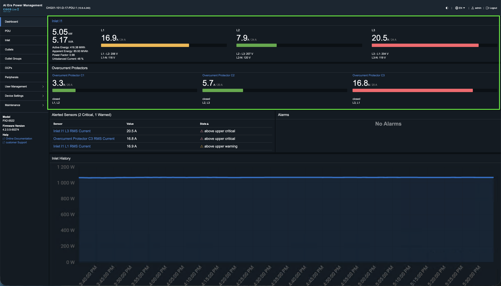
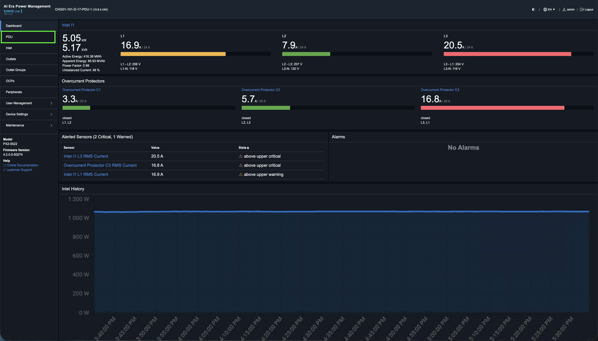
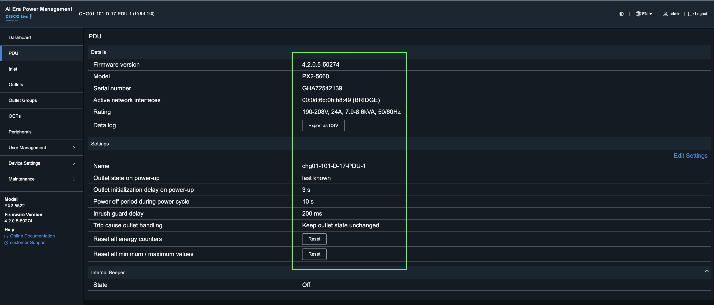
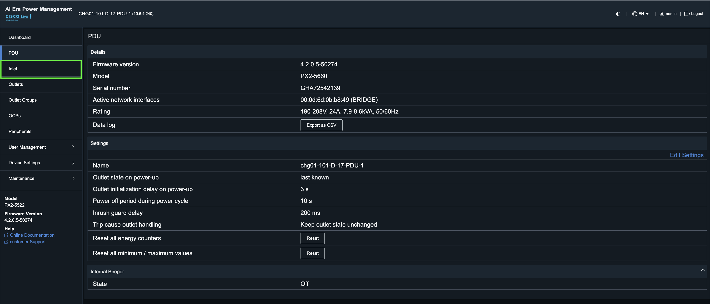
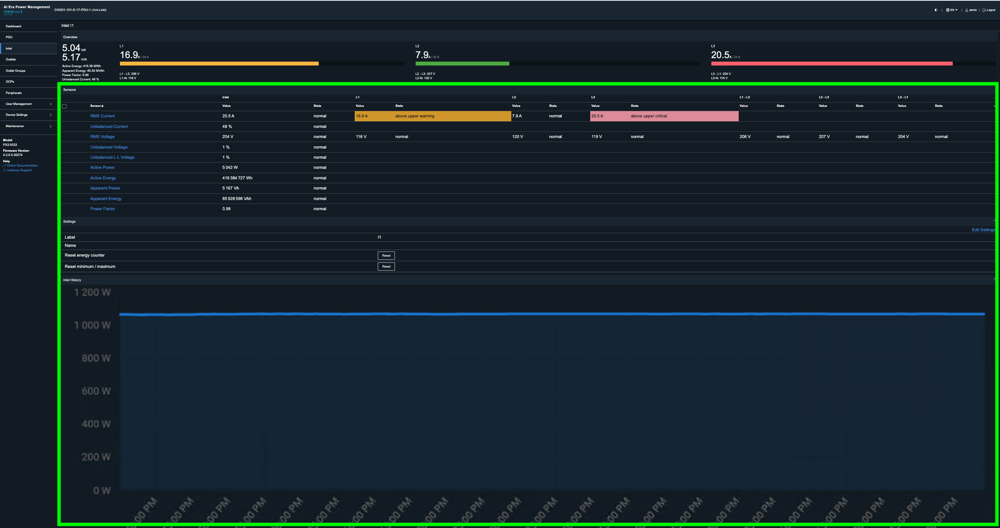
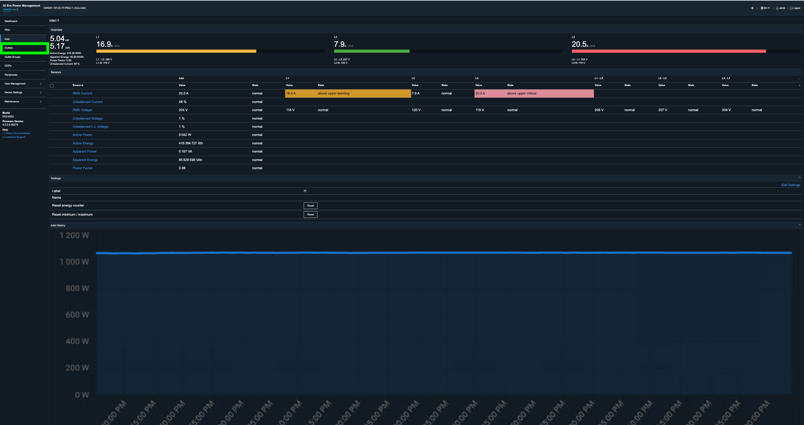
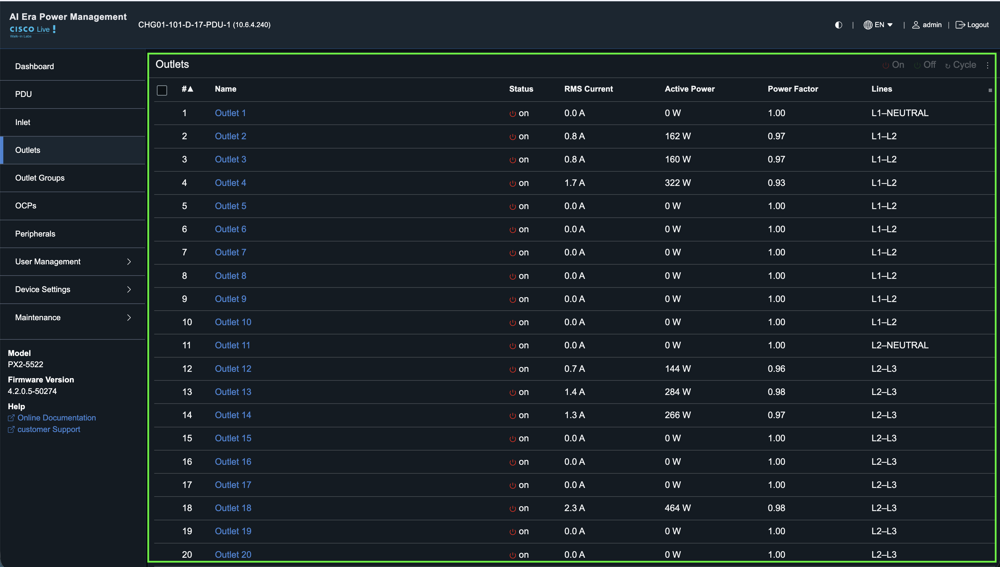

# Task 3: Optimize PDU Capacity and Phase Balance for CHG01-101 AI Readiness

**Objective:** The CHG01-101 facility is currently reporting threshold alerts for **CHG01-101-D-17-PDU-1**. As we prepare for high-density AI server integration, maintaining optimal power headroom is critical. You are tasked with conducting a deep-dive investigation to mitigate overload risks and stabilize power distribution.

## Step 1: Explore the Smart PDU GUI — Dashboard

Login to the Smart PDU GUI. The primary dashboard provides a centralized view of the unit's real-time electrical telemetry. The interface displays critical load data across the three-phase power distribution lines — designated as **L1**, **L2**, and **L3** — allowing for granular monitoring of current (Amps), voltage, and phase-specific load distribution.

<figure markdown>
  
  <figcaption>PDU CHG01-101-D-17-PDU-1 — Dashboard with 3-phase current monitoring</figcaption>
</figure>

This section provides an overview of PDU CHG01-101-D-17-PDU-1, including 3-phase current monitoring and total power consumption (kW). The L3 phase is currently indicating a high-load state; to mitigate this, we recommend rebalancing the load by migrating devices from L3 to L2.

## Step 2: Explore the Smart PDU GUI — PDU Tab

Click the **PDU** tab on the left side navigation bar. This view provides the Overview dashboard for PDU CHG01-101-D-17-PDU-1. It serves as the primary information hub for the device, consolidating hardware identification, firmware status, and operational configuration settings.

<figure markdown>
  
  <figcaption>PDU CHG01-101-D-17-PDU-1 — Dashboard with 3-phase current monitoring</figcaption>
</figure>

<figure markdown>
  
</figure>

**Details Section** — This area displays the core asset information required for inventory management and troubleshooting:

- **Firmware Version:** Displays the current software build installed on the PDU.
- **Model:** Identifies the specific hardware model (e.g., PX3-5561).
- **Serial Number:** The unique identifier for the physical unit.
- **Active Network Interfaces:** Lists the communication ports currently in use (e.g., eth0, eth1).
- **Rating:** Specifies the power input rating (Voltage, Phase, and Frequency).

## Step 3: Explore the Smart PDU GUI — Inlet

Click the **Inlet** tab from the left-hand navigation menu to view detailed information regarding the PDU inlets.

<figure markdown>
  
</figure>

This view provides a granular, real-time analysis of the PDU's electrical performance at the inlet level. It is designed for monitoring load distribution and identifying potential power issues across the three phases.

<figure markdown>
  
</figure>

**Key Sections of the View:**

- **Phase Summary (Top Bar):**
    - Displays real-time current readings for phases L1, L2, and L3.
    - **Status Indicators:** Provides immediate visual alerts regarding power thresholds. In this instance, L1 is flagged as "above peak warning" (yellow), L2 is "normal" (green), and L3 is "above peak critical" (red), highlighting the need for load balancing.

- **Detailed Metrics Table:**
    - Lists specific electrical parameters, including RMS Current, RMS Voltage, Active/Apparent/Reactive Power, Apparent Energy, and Power Factor.
    - This allows engineers to perform a deep-dive analysis into the PDU's power quality and efficiency.

- **Historical Power Trend Graph:**
    - A visual representation of power consumption (measured in Watts) over time. This graph is essential for identifying historical load patterns and verifying the impact of load-balancing adjustments.

## Step 4: Explore the Smart PDU GUI — Outlets

Click the **Outlets** tab from the left-hand navigation menu to view detailed information regarding the PDU outlets.

<figure markdown>
  
</figure>

This table allows lab technicians to monitor the status and power draw of every individual outlet (1 through 24) on the PDU.

<figure markdown>
  
</figure>

**Column Definitions:**

| Column          | Description |
| --------------- | ----------- |
| ID & Name       | Identifies the specific physical outlet on the PDU |
| Status          | Indicates whether the outlet is currently powered on (green icon) |
| RMS Current (A) | Displays the real-time electrical current draw for the connected device |
| Active Power (W)| Shows the actual power consumption in Watts |
| Power Factor    | Indicates the efficiency of the power usage for the connected device |
| Line            | Identifies which phase (L1, L2, or L3) the outlet is connected to |

## Putting It All Together

By leveraging these three primary views, you can execute a systematic approach to optimize PDU capacity and balance the electrical phases for CHG01-101-D-17-PDU-1:

1. **Identify the Issue (Inlet View):** Use the Inlet dashboard to monitor real-time phase health. This view acts as your primary alert system, allowing you to quickly spot phases — such as L3 — that are nearing or exceeding safe operating thresholds.

2. **Verify Asset Integrity (Overview View):** Use the Overview dashboard to confirm the PDU's hardware status, firmware version, and operational settings. This ensures the unit is healthy and properly configured for capacity optimization before you perform any load-balancing adjustments.

3. **Execute the Solution (Outlets View):** Use the Outlets dashboard to perform granular analysis. By reviewing the power draw (Amps/Watts) of individual outlets, you can pinpoint specific high-load devices contributing to phase imbalances and determine which can be safely migrated to underutilized phases.

## Result

By synthesizing these high-level phase alerts with granular outlet-level data, you can proactively prevent hardware throttling, mitigate the risk of equipment failure, and maximize the power density of CHG01-101-D-17-PDU-1. Consistent monitoring through these tabs ensures that your infrastructure operates at peak efficiency and reliability.

---
