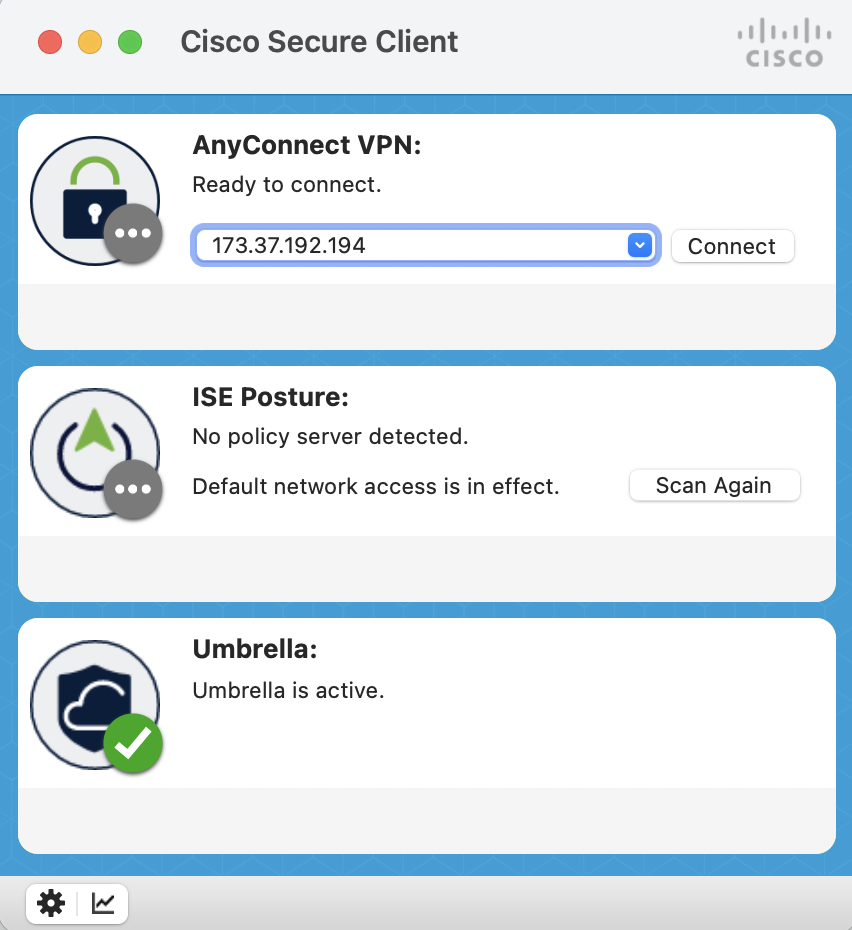
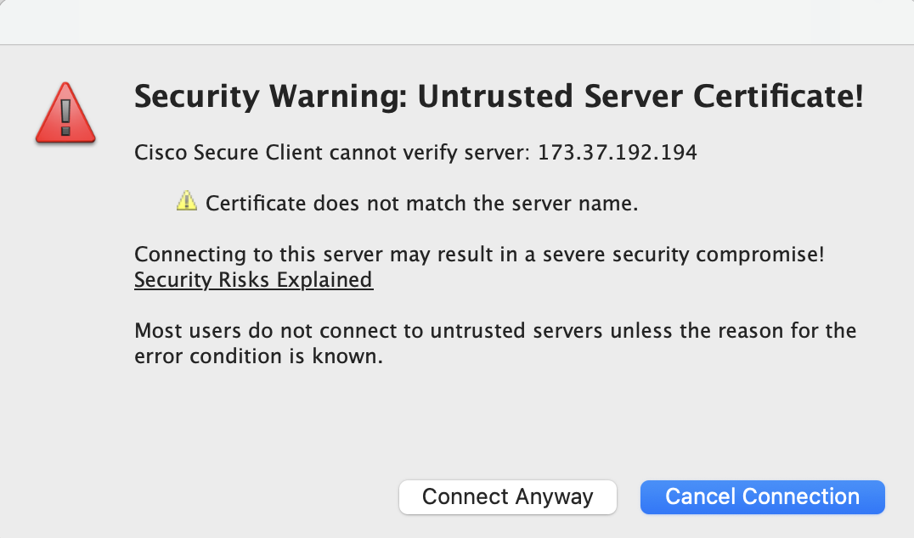
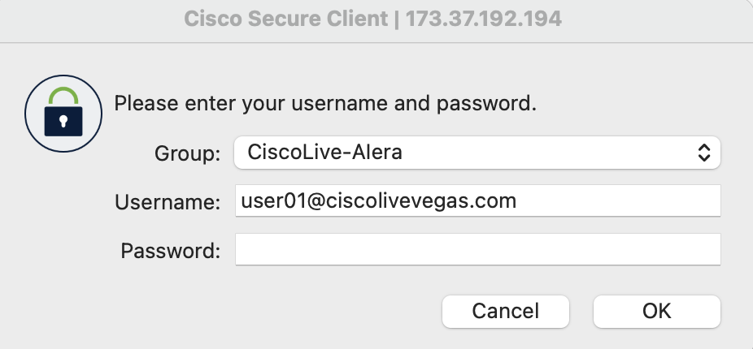
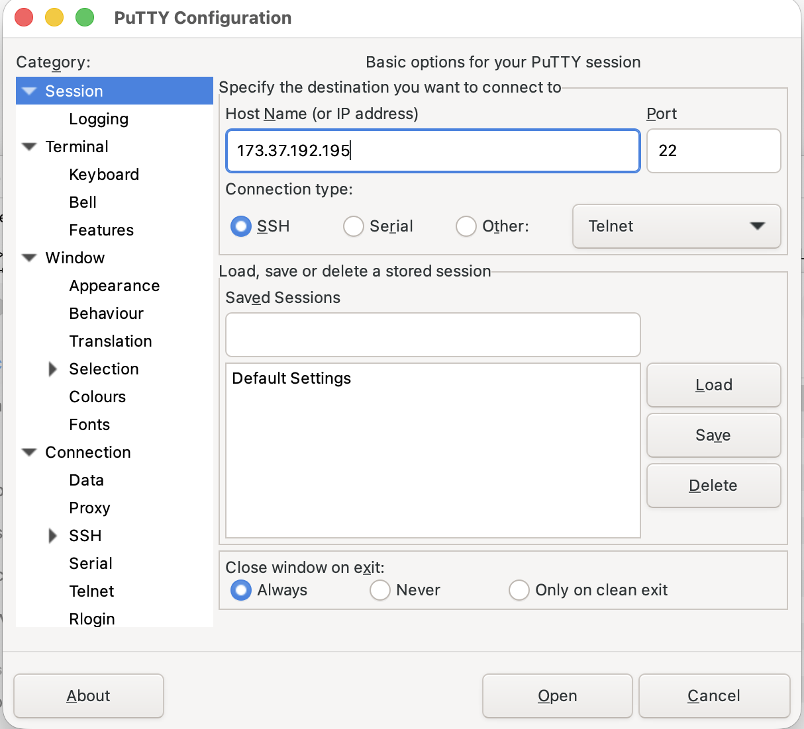
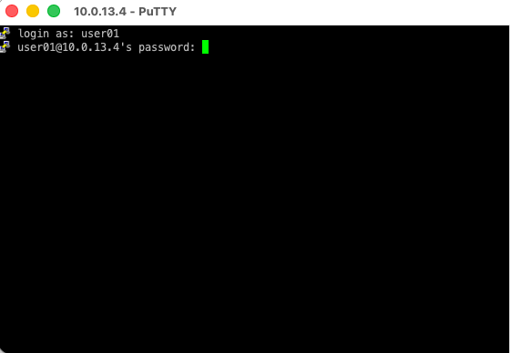
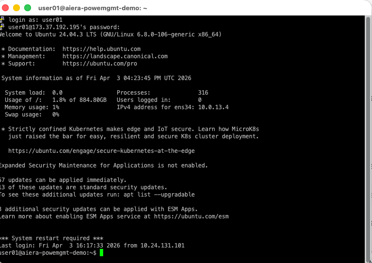

# Task 4: Run the Python Script to Query Splunk Data

As part of this walk-in lab, a **Python-based script** is used to query **Splunk** directly for real-time power management and environmental telemetry. This demonstrates that the data displayed in **Splunk dashboards** is also available through **script-based access** for automation, quick checks, and **CLI-driven workflows**.

!!! warning
    If you use **User01** for VPN access, you must use the corresponding **User01** for **PuTTY/SSH** access and the password associated only with it. For additional user login credentials: [Click Here](creds.md)

## Step 1: Connect to VPN

First, establish a **VPN connection** to the **lab network**.

**1a.** Open **Cisco Secure Client** and enter the VPN address: `173.37.192.194`

<div class="dashboard-imgs" style="max-width:450px; margin:auto;" markdown>
<figure markdown>
  
</figure>
</div>

**1b.** If prompted with a security warning, select **Connect Anyway** to proceed.

<div class="dashboard-imgs" style="max-width:450px; margin:auto;" markdown>
<figure markdown>
  
</figure>
</div>

**1c.** Enter the credentials below and click **OK** to connect.

| Field      | Value                          |
| ---------- | ------------------------------ |
| `Username` | {{ be_script_vpn.username }} |
| `Password` | {{ be_script_vpn.password }} |

<div class="dashboard-imgs" style="max-width:450px; margin:auto;" markdown>
<figure markdown>
  
</figure>
</div>

!!! info "Note"
    For additional user login credentials: [Click Here](creds.md).

## Step 2: SSH into the Lab VM

Once the VPN is connected, use **PuTTY** (or any SSH client) to connect to the **lab VM**.

**2a.** Open **PuTTY**, enter the lab VM IP address (`10.0.13.4`), and click **Open**.

<div class="dashboard-imgs" style="max-width:750px; margin:auto;" markdown>
<figure markdown>
  
</figure>
</div>

**2b.** At the login prompt, use the below **username** and **password** to SSH into the VM.

| Field      | Value                          |
| ---------- | ------------------------------ |
| `Username` | {{ be_script_putty.username }} |
| `Password` | {{ be_script_putty.password }} |

<div class="dashboard-imgs" style="max-width:750px; margin:auto;" markdown>
<figure markdown>
  
</figure>
</div>

<div class="dashboard-imgs" style="max-width:750px; margin:auto;" markdown>
<figure markdown>
  
</figure>
</div>

## Step 3: Launch the Script

Once logged in, verify the script is present and launch it:

```bash
> ls
```

You should see `cisco_live_demo_data.py` in the file listing. Run it with:

```bash
> python3 cisco_live_demo_data.py
```

You will see the application banner and a site selection menu:

```
------------------------------------
| AI ERA POWER MANAGEMENT LAB DEMO |
------------------------------------

SELECT A SITE:
--------------
  1. SEATTLE (Preferred)
  2. CHICAGO
  3. DELHI
  4. FRANCE
  5. SINGAPORE
```


## Step 4: Select a Site

Enter **1** to select **SEATTLE** (the preferred site for this lab). The script will automatically map the site to its **Data Center identifier**:

```
> Select an option: 1

Data Center auto selected: SEA01-103
```

After selection, the scenario menu is displayed:

```
SCENARIOS:
----------
  1. Power capacity
  2. PDU details overview
  3. Offline PDUs
  4. PDUs exceeding 90% capacity
  5. Data Center Temperature
  6. Row Temperature
  7. Rack Temperature
  8. Exit
```


## Step 5: Query Power Capacity

Choose **1** to display a summary of the Data Center's **power capacity**. This will show the total capacity (at the **80% safety threshold**), the current active power consumption, and the remaining power available for deploying more devices:

```
> Select a scenario: 1

Power capacity for Data Center SEA01-103:
-----------------------------------------
Power Capacity     : 1,315 kW
Active Power Drawn : 601.4100 kW
Available Power    : 713.5900 kW
```

Press "Enter" to return to the scenario menu.


## Step 6: Query PDU Details Overview

Enter **2** to retrieve a summary of **PDU fleet status**, including total count and breakdown by **operational state**:

```
> Select a scenario: 2

PDU details overview for Data Center SEA01-103:
-----------------------------------------------
Total PDU count   : 272
In-use PDUs       : 217
Available PDUs    : 43
Offline PDUs      : 12
```

Press "Enter" to return to the scenario menu.

## Step 7: Identify Offline PDUs

Enter **3** to list all PDUs currently in an **offline state**. Each entry includes the **rack name** and **host IP address** for troubleshooting:

```
> Select a scenario: 3

Offline PDUs for Data Center SEA01-103:
---------------------------------------

[1]
    Data_Center: SEA01-103
    Rack: SEA01-103-AM-6-PDU-2
    Host_ip: 10.0.153.77

[2]
    Data_Center: SEA01-103
    Rack: SEA01-103-AM-10-PDU-1
    Host_ip: 10.0.153.86

[3]
    Data_Center: SEA01-103
    Rack: SEA01-103-AP-2-PDU-1
    Host_ip: 10.0.153.101

[4]
    Data_Center: SEA01-103
    Rack: SEA01-103-AR-15-PDU-2
    Host_ip: 10.0.153.241

[5]
    Data_Center: SEA01-103
    Rack: SEA01-103-AR-16-PDU-2
    Host_ip: 10.0.153.242

[6]
    Data_Center: SEA01-103
    Rack: SEA01-103-AY-8-PDU-2
    Host_ip: 10.0.154.209

[7]
    Data_Center: SEA01-103
    Rack: SEA01-103-AD-4-PDU-1
    Host_ip: 10.225.243.130

[8]
    Data_Center: SEA01-103
    Rack: SEA01-103-AD-5-PDU-1
    Host_ip: 10.225.243.131

[9]
    Data_Center: SEA01-103
    Rack: SEA01-103-AD-6-PDU-1
    Host_ip: 10.225.243.132

[10]
    Data_Center: SEA01-103
    Rack: SEA01-103-AD-7-PDU-1
    Host_ip: 10.225.243.133

[11]
    Data_Center: SEA01-103
    Rack: SEA01-103-AD-8-PDU-1
    Host_ip: 10.225.243.134

[12]
    Data_Center: SEA01-103
    Rack: SEA01-103-AD-9-PDU-1
    Host_ip: 10.225.243.135
```

!!! warning
    Offline PDUs may indicate **network connectivity** issues or **hardware failures**.

Press "Enter" to return to the scenario menu.

## Step 8: Identify PDUs Exceeding 90% Capacity

Enter **4** to view PDUs that are operating above **90% load threshold**. Each entry displays the current power drawn in amps, and utilization in percentage:

```
> Select a scenario: 4

PDUs exceeding 90% capacity for Data Center SEA01-103:
------------------------------------------------------

Count : 10

Details:
--------

[1]
    Data_Center: SEA01-103
    Row: AU
    Rack: SEA01-103-AU-7-PDU-2
    Value: 21.78 amps
    PDU_consumption: 90.8%

[2]
    Data_Center: SEA01-103
    Row: AU
    Rack: SEA01-103-AU-12-PDU-2
    Value: 22 amps
    PDU_consumption: 91.7%

[3]
    Data_Center: SEA01-103
    Row: AE
    Rack: SEA01-103-AE-8-PDU-1
    Value: 22 amps
    PDU_consumption: 91.7%

[4]
    Data_Center: SEA01-103
    Row: AS
    Rack: SEA01-103-AS-9-PDU-1
    Value: 22 amps
    PDU_consumption: 91.7%

[5]
    Data_Center: SEA01-103
    Row: AS
    Rack: SEA01-103-AS-4-PDU-1
    Value: 22 amps
    PDU_consumption: 91.7%

[6]
    Data_Center: SEA01-103
    Row: AL
    Rack: SEA01-103-AL-6-PDU-2
    Value: 22 amps
    PDU_consumption: 91.7%

[7]
    Data_Center: SEA01-103
    Row: AC
    Rack: SEA01-103-AC-3-PDU-2
    Value: 22 amps
    PDU_consumption: 91.7%

[8]
    Data_Center: SEA01-103
    Row: AY
    Rack: SEA01-103-AY-1-PDU-2
    Value: 22 amps
    PDU_consumption: 91.7%

[9]
    Data_Center: SEA01-103
    Row: AC
    Rack: SEA01-103-AC-5-PDU-1
    Value: 22 amps
    PDU_consumption: 91.7%

[10]
    Data_Center: SEA01-103
    Row: AY
    Rack: SEA01-103-AY-4-PDU-2
    Value: 22 amps
    PDU_consumption: 91.7%
```

!!! danger "Critical"
    PDUs at or above **90% consumption** are exceeding their rated capacity and pose a risk of **breaker trips**. Immediate **load redistribution** is recommended.

Press "Enter" to return to the scenario menu.


## Step 9: Query Data Center Temperature

Enter **5** to retrieve the **average temperature** across the entire Data Center:

```
> Select a scenario: 5

Temperature for Data Center SEA01-103:
--------------------------------------
73.54°F / 27.52°C
```

!!! tip
    This data provides a quick **health check** of Data Center **cooling status**, with **safe operating temperatures** generally maintained between 64.4°F and 80.6°F (18–27°C).

Press "Enter" to return to the scenario menu.


## Step 10: Query Row Temperature

Enter **6** to drill down into a specific row or aisle to analyze the temperature. When prompted, enter a **row identifier** (e.g., ac):

```
> Select a scenario: 6

Row Temperature for Data Center SEA01-103:
------------------------------------------

Specify the Row/Aisle to monitor (Enter:'ac'): ac

Temperature data:
-----------------
    Data_Center: SEA01-103
    Row: AC
    Avg_Temp: 72.94°F / 22.19°C
    Avg_Humidity: 8.63%
    MT10_sensor_battery_life: 100.0%
```

The output includes temperature, humidity, and Meraki MT10 sensor battery status for the selected row.

Press "Enter" to return to the scenario menu.


## Step 11: Query Rack Temperature

Enter **7** to inspect a specific rack. When prompted, enter the **rack identifier** in the format (e.g., ac-4):

```
> Select a scenario: 7

Rack Temperature for Data Center SEA01-103:
-------------------------------------------

Specify the Rack to monitor (Enter:'ac-4'): ac-4

Rack Temperature:
-----------------
    Data_Center: SEA01-103
    Row: AC
    Rack: SEA01-103-AC-4-PDU-1
    Temp: 76.09°F / 24.39°C
    Humidity: 8%
    MT10_sensor_battery_life: 100%
```

The output shows the temperature, humidity and sensor battery life for rack AC-4.

Press "Enter" to return to the scenario menu.


## Step 12: Exit the Script

When finished exploring, enter **8** to exit the script:

```
> Select a scenario: 8

✨Thank you for exploring our AI Era Power Management Lab Demo!
  Have an incredible time at Cisco Live and enjoy the rest of your experience!✨
```


## Result

You have used the **Python script** to programmatically query all our key **Data Center metrics** -- power capacity, PDU fleet status, overloaded PDUs, and environmental conditions -- providing a complementary, **script-based approach** to the **Splunk dashboard** workflows covered in the earlier scenarios.

---
