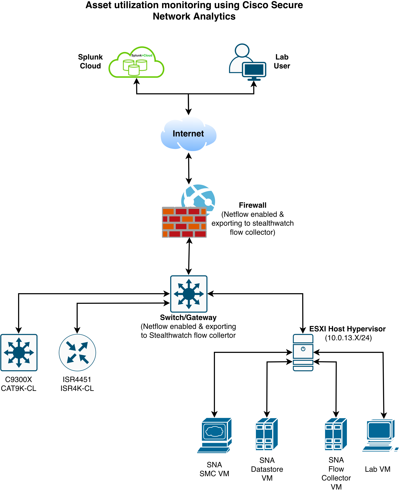

# Overview

This lab provides step-by-step instructions on how to configure Cisco Secure Network Analytics (SNA) to monitor device-level flow counts and export network telemetry data to Splunk for centralized analysis and reporting.

## Scenario: Unified Power Management Across Distributed Data Centers

In this lab, you are a network engineer responsible for managing a data center environment. Your primary objective is to monitor device access by configuring Cisco Secure Network Analytics (SNA) to track asset utilization using their IP addresses. Through this configuration, you will collect detailed telemetry data, including flow records, to analyze how frequently each device is accessed and understand network activity patterns.

Additionally, you will learn how to integrate and visualize SNA telemetry data within Splunk Cloud. This integration enables you to enrich network insights by leveraging Splunk’s powerful analytics and dashboard capabilities, providing a unified view of device utilization and network behavior. By the end of this lab, you will be equipped to transform raw network flow data into actionable intelligence, helping optimize asset usage and improve operational efficiency.

<figure markdown>
  
</figure>

## Learning Objectives

Upon completion of this lab, you will be able to:


- {{ obj }}


!!! Note
    The datacenter entry gateway is pre-configured for NetFlow, streaming telemetry to the SNA Flow Collector for analysis. Additionally, the SNA virtual appliances has been pre-provisioned to support the tasks in this lab.

!!! note "Quick Notes"
    ### What is a Flow Collector?

    - A Flow Collector is a core component of the Cisco Secure Network Analytics (SNA) architecture. Its primary function is to **ingest, deduplicate, and store flow data** (such as NetFlow) exported from network devices.
    - By processing this telemetry, the Flow Collector provides the **Stealthwatch Management Console (SMC)** with the granular data necessary for network-wide visibility, behavioral analysis, and threat detection.

    ### Why is Visibility into Device Access Important?

    Maintaining visibility into how often devices are accessed within the data center is critical for several reasons:

    - **Security Posture:** Tracking access patterns allows administrators to identify anomalous behavior, such as unauthorized lateral movement or potential data exfiltration attempts.
    - **Compliance:** Many regulatory frameworks require organizations to maintain logs of who accessed which resources, for how long, and with what frequency.
    - Troubleshooting: Detailed flow logs provide a historical audit trail, making it easier to diagnose connectivity issues or performance bottlenecks between endpoints.

    ### Benefits of Monitoring for Capacity Planning

    Beyond security, monitoring device access provides actionable insights for infrastructure management:

    - **Predictive Resource Allocation:** By analyzing traffic trends, administrators can identify highly utilized servers or services. This enables proactive scaling decisions, such as adding hardware or increasing bandwidth, to prevent performance degradation before it occurs.
    - **Optimization of Assets:** Monitoring reveals underutilized devices, allowing IT teams to consolidate workloads, reduce power consumption, and optimize the overall data center footprint.
    - **Trend Analysis:** Establishing a baseline of "normal" traffic patterns helps in forecasting future growth requirements, ensuring that the data center infrastructure evolves in alignment with business demands.

!!! warning "Disclaimer"
    This lab was designed exclusively for educational and training purposes. The activities performed within this environment are conducted on controlled dashboards and do not reflect real-time changes to live production infrastructure.
