# Task 1: Simulating Asset Utilization Using NetFlow

To verify the **SNA** environment is capturing **NetFlow** as intended, you will access **SEA01-103** data center assets via **SSH** and **HTTPS** to generate network traffic. Using more than one protocol and path helps populate diverse flow records for later analysis in **Flow Search** and **Splunk**.

!!! important "Capture your client IPv4"
    After VPN connects, record the **Client (IPv4)** from Cisco Secure Client's **Status Overview**. You will need this value in **Task 2** as a **Subject IP** filter so that exported flow records match only the traffic from your session.

## Step 1: Connecting to the VPN

For this task, you will need to connect to the lab environment through our VPN.

- Open **Cisco Secure Client**, enter the VPN address: **173.37.192.194** and select **Connect**.

<figure markdown>
  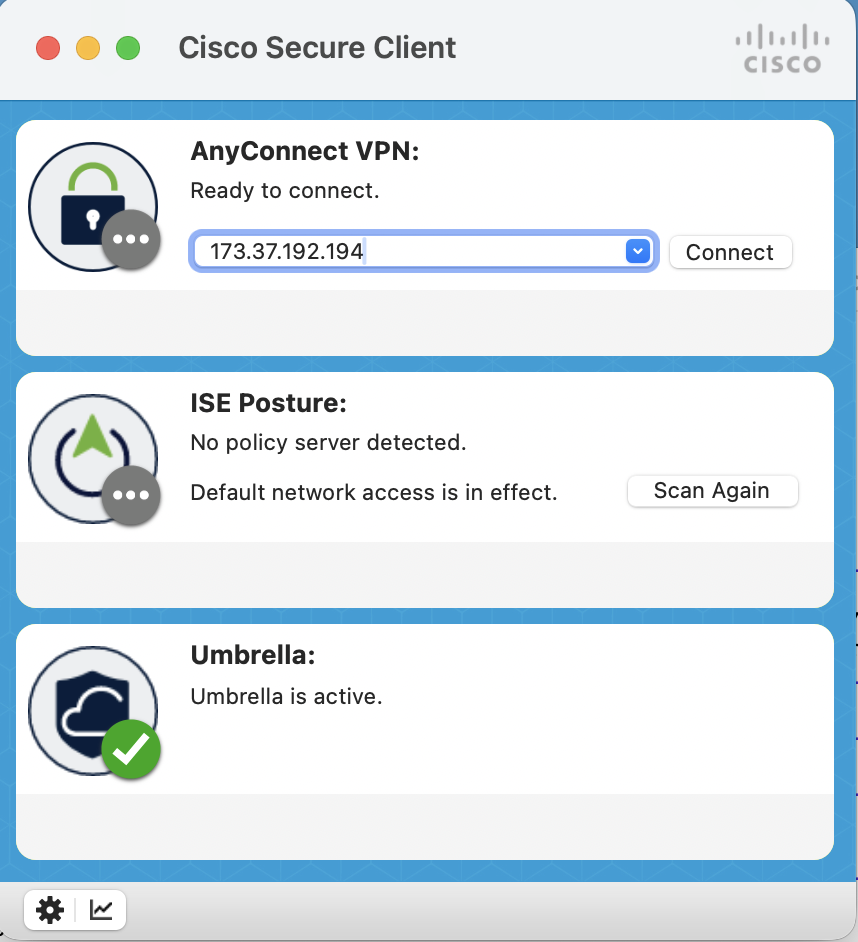
</figure>

- If prompted with a security warning, select **Connect Anyway** to proceed.

<figure markdown>
  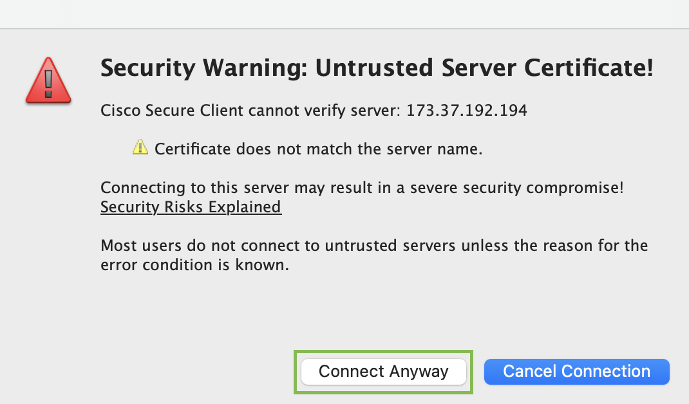
</figure>

- Enter the credentials listed below and select **OK** to connect

    | Field     | Value                      |
    |-----------|----------------------------|
    | Username  | `user01@ciscolivevegas.com` |
    | Password  | `eaHZP_a8zphk*ty`          |

<figure markdown>
  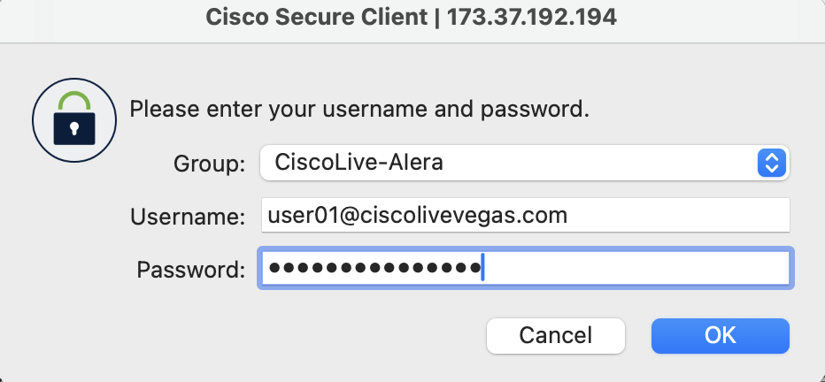
</figure>

- After successfully connecting, open **Cisco Secure Client** again and navigate to the location respective to your operating system:

    - **macOS**: Click **Statistics** (graph icon).
    - **Windows**: Click **Advanced Window** (gear icon).

<figure markdown>
  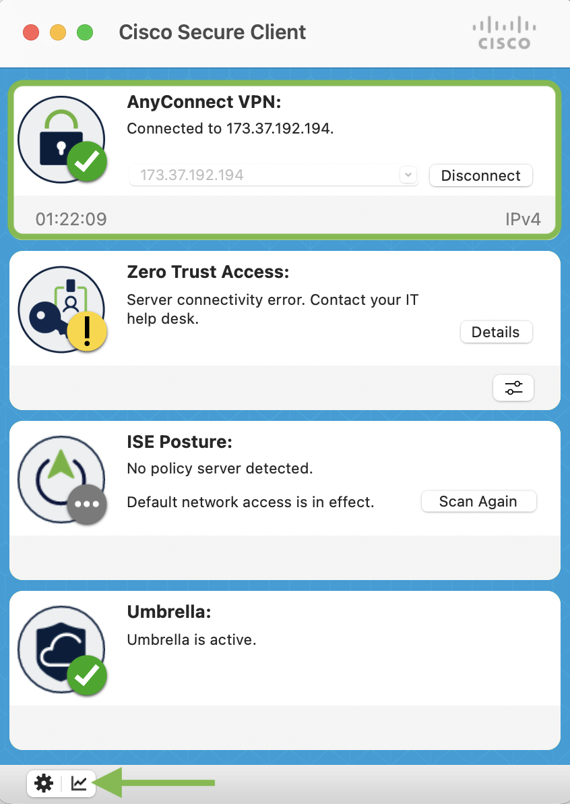
</figure>

- Navigate to **AnyConnect VPN**.
- Note down the IP Address next to **Client (IPv4)**. You will need to reference it later in the next Task. In the **example below**, the IP Address is `172.30.255.2`

<figure markdown>
  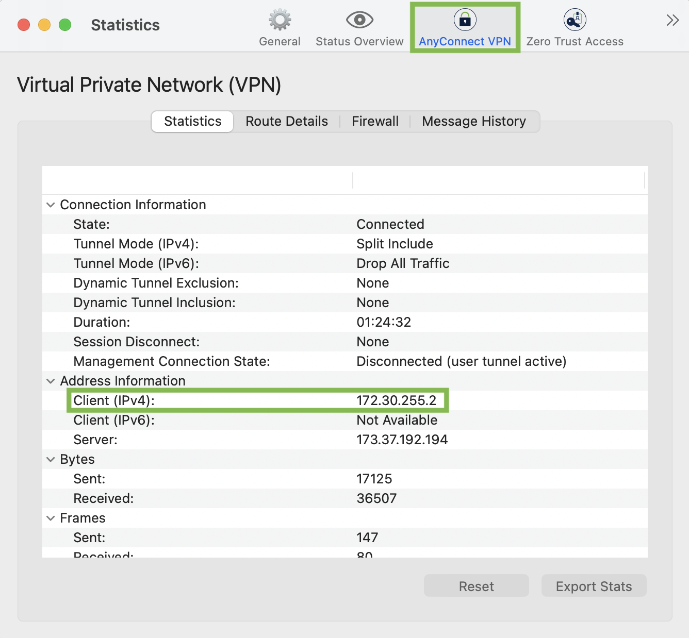
</figure>

## Step 2: Accessing the Device: ISR4K-CL via SSH

The first asset in the **SEA01-103** data center that you will access is a Cisco **ISR4451** router. Using **PuTTY**, you will connect to the command-line interface via **SSH**. The access information is provided below.

- Open **PuTTY**, then enter `10.0.13.70` in the **Host Name (or IP Address)** field.
- Verify that **Port** is **22** and **Connection type:** is **SSH**, then select **Open**.

<figure markdown>
  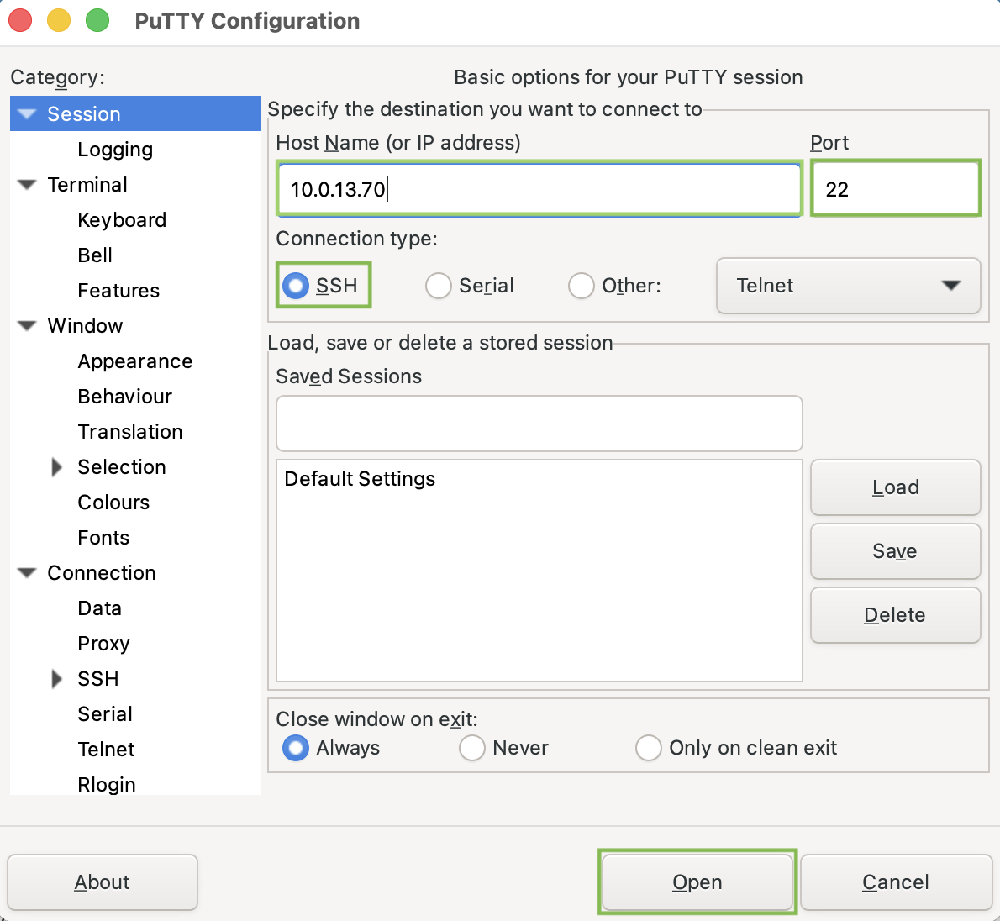
</figure>

- If prompted, press **"Accept"** to continue

!!! note "SSH Host Key"
    The first time you connect to a device via SSH, you may see a host-key fingerprint warning. This is expected in a lab environment — accept it to continue.

<figure markdown>
  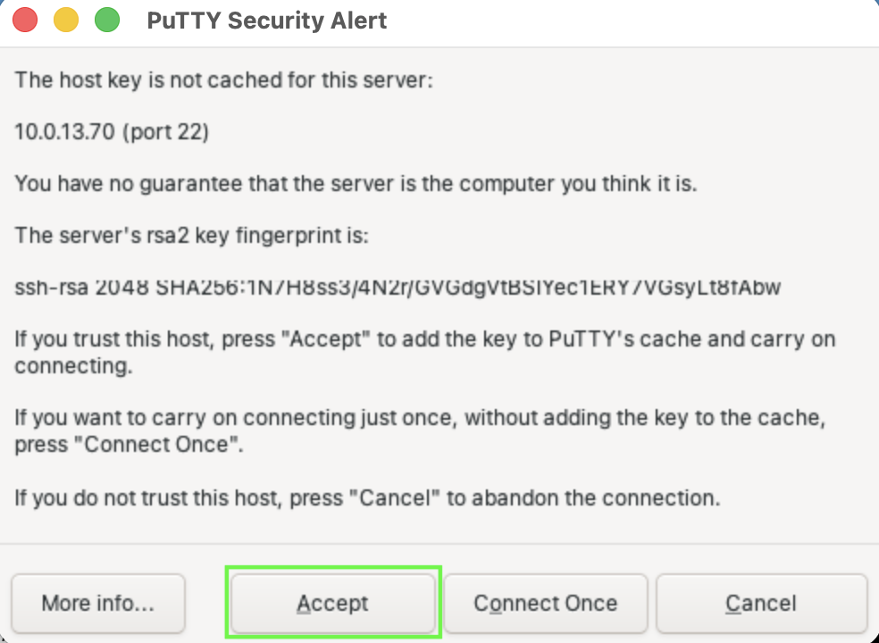
</figure>

- The asset terminal will open. At the login prompt, enter the **username**: `aiera-user` and press **Enter**.
- At the password prompt that follows, enter the **password**: `Ciscolive!135` and press **Enter**.
- When entered correctly, you will see the enable prompt for **ISR4K-CL**.

<figure markdown>
  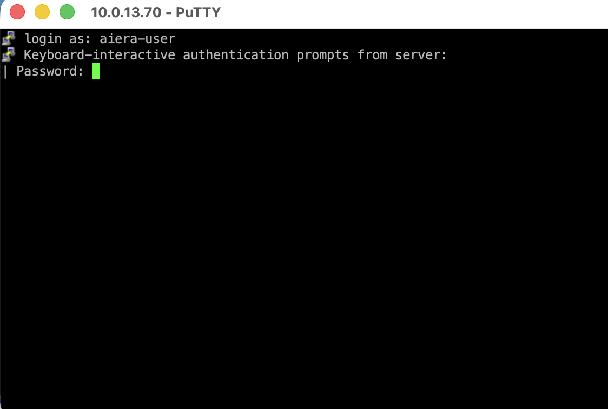
  <figcaption>Enter username at the login prompt</figcaption>
</figure>

<figure markdown>
  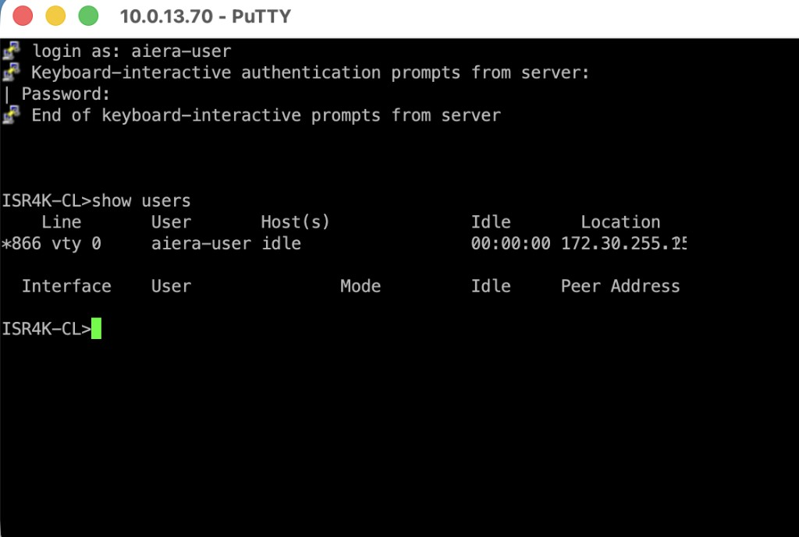
  <figcaption>Enable prompt after successful login</figcaption>
</figure>

- At the enable prompt, enter the commands: `show users`, `show ip interface brief`, and `show ip route` and press **Enter** to simulate additional network traffic to this asset.

<figure markdown>
  
  <figcaption>Command: show users</figcaption>
</figure>

<figure markdown>
  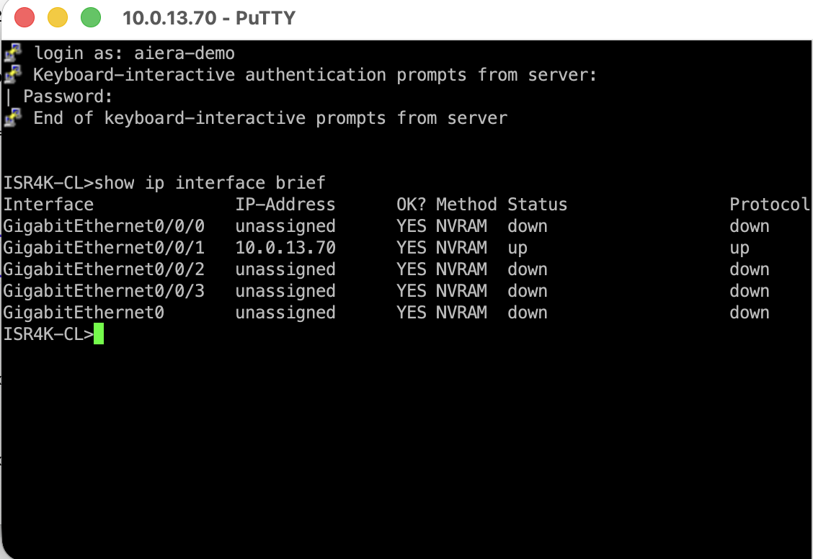
  <figcaption>Command: show ip interface brief</figcaption>
</figure>

<figure markdown>
  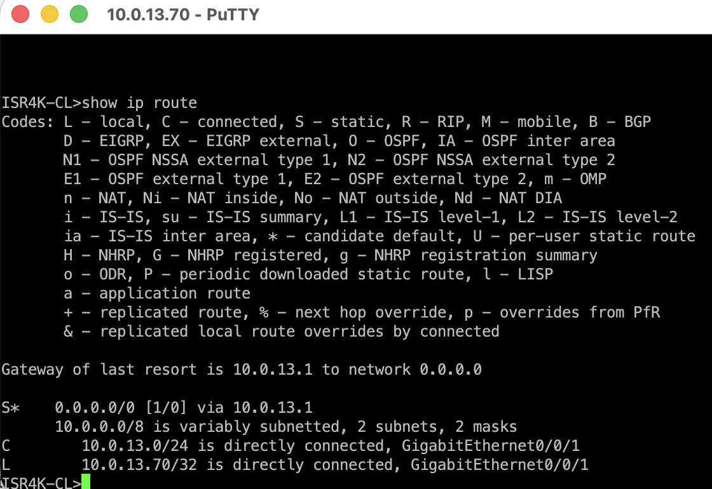
  <figcaption>Command: show ip route</figcaption>
</figure>

- Close the terminal window to exit the session.

## Step 3: Accessing CAT9K-CL via SSH

The next **SEA01-103** asset that you will access is a Cisco **C9300X-48HX** switch. Using **PuTTY**, you will connect to the command-line interface via **SSH**. The access information is provided below.

- Open **PuTTY**, then enter `10.0.13.71` in the **Host Name (or IP Address)** field.
- Verify that **Port** is **22** and **Connection type:** is **SSH**, then select **Open**.

<figure markdown>
  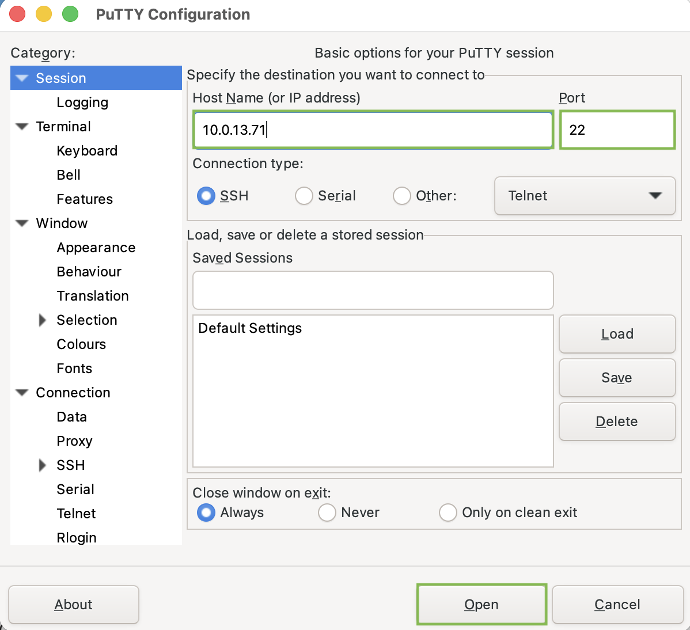
</figure>

- The asset terminal will open. At the login prompt, enter the username: `aiera-user` and press **Enter**.
- At the password prompt, enter the password: `Ciscolive!135` and press **Enter**. When entered correctly, you will arrive at the enable prompt for **CAT9K-CL**.
- At the enable prompt, enter the command: `show ip interface brief` and press **Enter** to simulate additional network traffic to this asset.

<figure markdown>
  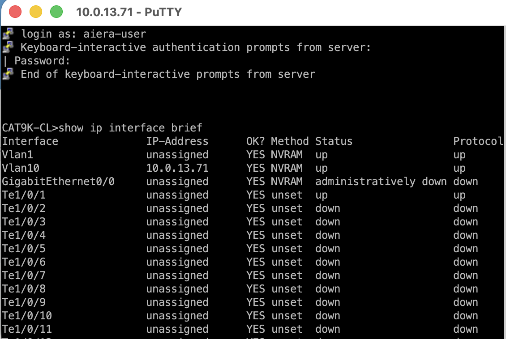
</figure>

- Close the terminal window to exit the session.

## Step 4: Accessing CAT9K-CL via HTTPS

You will now access **CAT9K-CL** again — this time over **HTTPS**. Accessing the same device using different protocols (**SSH** in Step 3, **HTTPS** here) produces richer flow attributes such as different port numbers and TLS (Transport Layer Security) fields, giving you more diverse data to analyze in later tasks.

!!! tip "Use Chrome"
    Keep **Google Chrome** for all **HTTPS** steps so your experience matches the lab guide and **Splunk** dashboard guidance.

- Open **Google Chrome**, enter or paste the URL: `https://10.0.13.71` into the address-bar, then press **Enter**.
- You will see a browser security warning. Click **Advanced**.

    

    <figure markdown>
      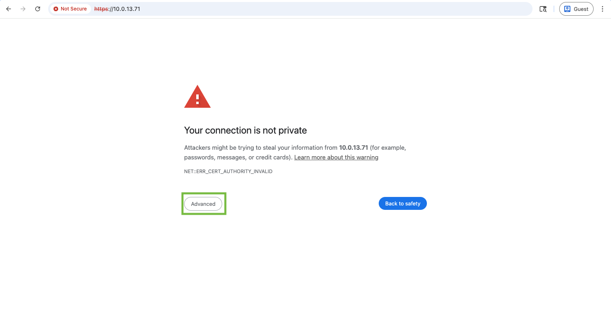
    </figure>
    

- Then click **"proceed to 10.0.13.71 (unsafe)"**

    

    <figure markdown>
      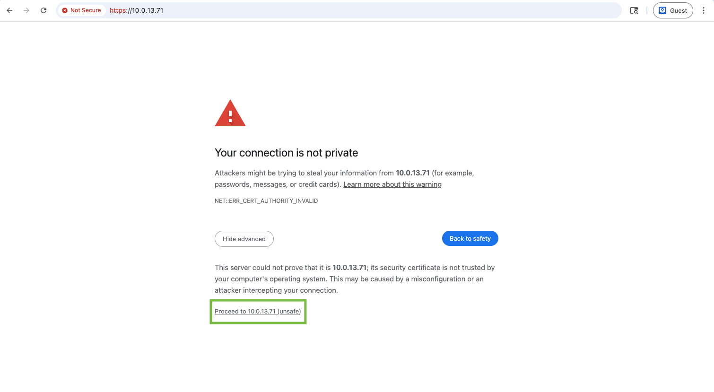
    </figure>
    

    !!! note "Self-signed certificate"
        The lab devices use self-signed certificates, so the browser warning is expected. In a production environment, devices would use certificates issued by a trusted CA.

- At the **CAT9K-CL** **WebUI** login screen, enter the following credentials and click **Log In**:

    | Field | Value |
    | ----- | ----- |
    | Username | `aiera-user@ciscolivevegas.com` |
    | Password | `Ciscolive!135` |

    

    <figure markdown>
      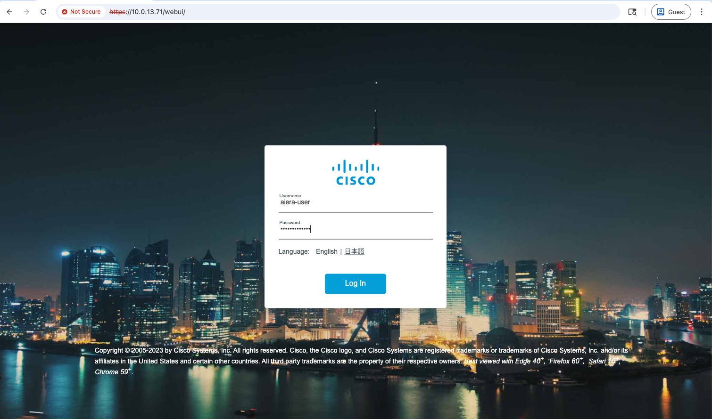
    </figure>
    

- The **CAT9K-CL** main dashboard will load.

    

    <figure markdown>
      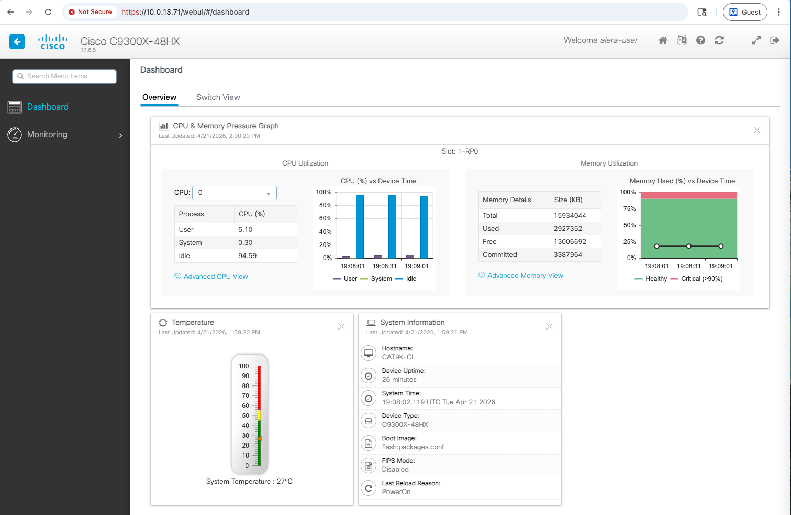
    </figure>
    

!!! tip "Generate more traffic"
    Feel free to navigate the **WebUI** to generate additional traffic associated with your laptop IP address. The more pages you visit, the more flow records will be captured for utilization monitoring.

When you are ready to end the session:

- Click the user icon in the top-right corner of the page
- Click **Log Out**
- When prompted with "Are you sure you want to log out?", click **Yes**
- Close the browser window

<figure markdown>
  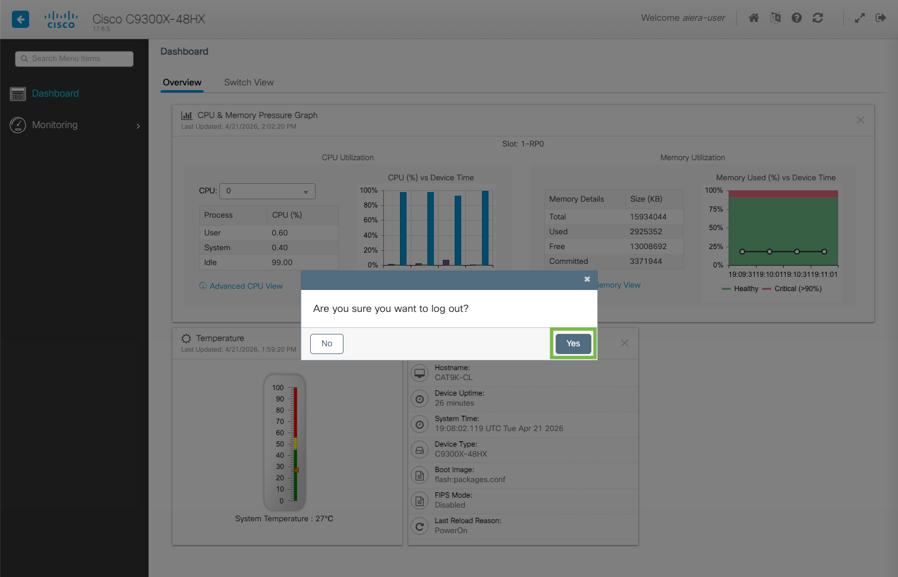
</figure>

## Result

In this task, you simulated network traffic to data center assets in the **SEA01-103** host group by accessing devices via **SSH** and **HTTPS**:

| Step | Device | Protocol | IP Address |
| ---- | ------ | -------- | ---------- |
| Step 2 | ISR4K-CL (Cisco ISR4451) | SSH (TCP/22) | `10.0.13.70` |
| Step 3 | CAT9K-CL (Cisco C9300X-48HX) | SSH (TCP/22) | `10.0.13.71` |
| Step 4 | CAT9K-CL (Cisco C9300X-48HX) | HTTPS (TCP/443) | `10.0.13.71` |

By generating flows using multiple protocols to multiple devices, you have confirmed that the **SNA** environment is actively capturing and organizing **NetFlow** telemetry. This traffic will be visible in the flow records you analyze in the upcoming tasks — first through **SNA Flow Search** (**Task 2**), then through **Splunk Cloud** queries (**Tasks 3 and 4**), and finally through a pre-built **Splunk** asset utilization dashboard (**Task 5**).

!!! warning "Remember"
    Keep the **Client (IPv4)** you recorded in **Step 1** handy — you will need it in **Task 2** to filter flow results to your specific session traffic.

!!! danger "Disconnect VPN"
    When you are finished with this task or leaving the workstation, **disconnect from the lab VPN** so your session is released.

    Open **Cisco Secure Client**, then choose **Disconnect** (or follow your proctor's close-down steps). Do **not** leave an active VPN tunnel running after you are done.

<figure markdown>
  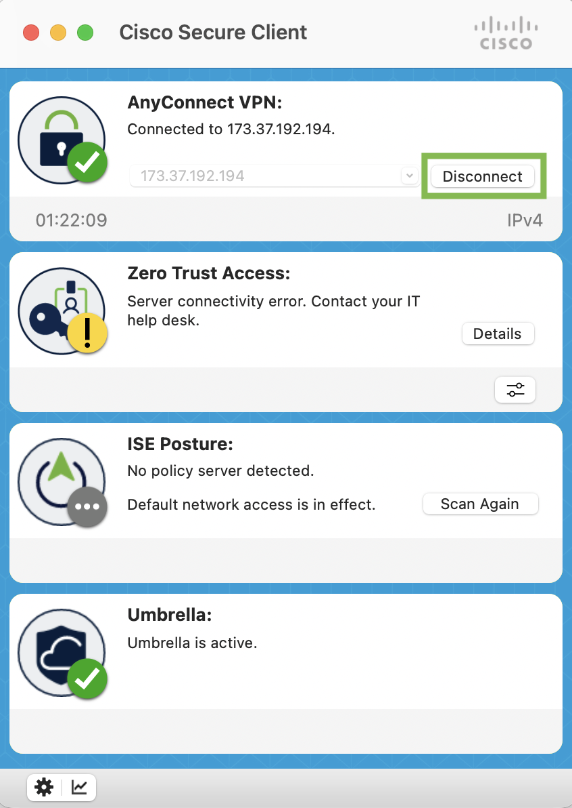
</figure>

---
