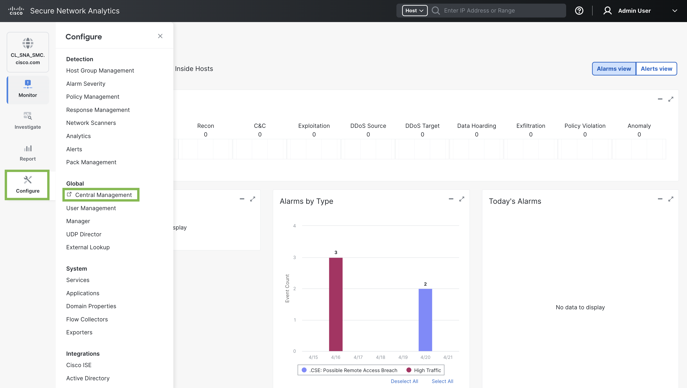
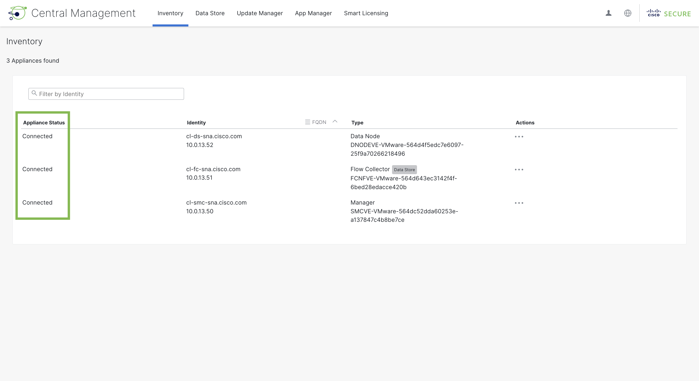
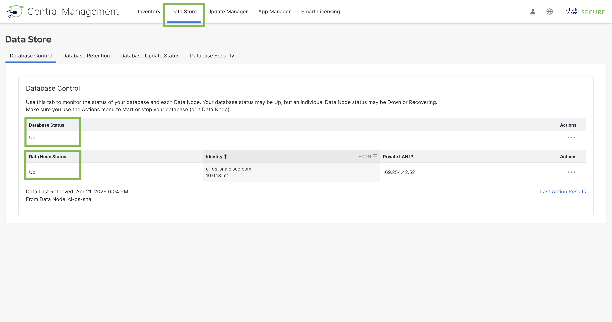
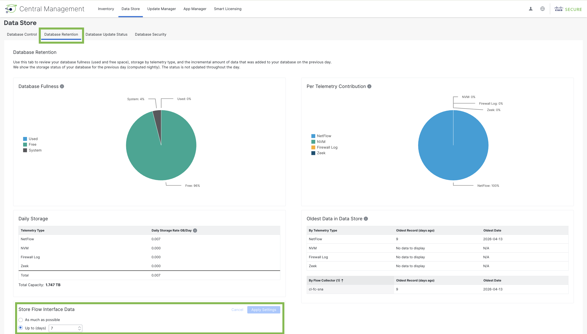

# Task 1: SNA Appliance Setup – Central Management

In this task, we will demonstrate how to navigate the SNA dashboard’s Central Management tool and view the status and settings of the virtual appliances that comprise your data center’s SNA environment. Each virtual appliance plays a vital role in this system, and it is crucial to verify they are correctly configured and operational. Through this process, you will be familiarized with the essential components of SNA and confirm that your deployment is ready to collect and monitor flow data.

## Step 1: Accessing the SNA Dashboard

!!! note "Read-only through Task 2"
    Tasks 1–2 focus on **reviewing** health and inventory in the UI. **REVISIT:** If your class later enables admin write tasks, align this note with the proctor script (Task 4 is where Flow Search sign-in is detailed separately in this guide).

- Enter your username and password, then click Sign In

<figure markdown>
  
</figure>

## Step 2: Navigating to Central Management

Central Management is the centralized management console for your SNA virtual appliances. It is a tool that provides full control over each appliance and detailed insight into their operations. Using Central Management, you will be able to edit your appliance settings and view their analytics data.

- In the sidebar, navigate to Configure > Central Management

<figure markdown>
  
</figure>

## Step 3: Verifying Virtual Appliance Status

To ensure your SNA environment is operational, you will check the status of each virtual appliance in the Inventory tab. This tab is the default view for Central Management.

- In the Appliance Status column, verify that each appliance is Connected. [3a]

<figure markdown>
  
</figure>

!!! note "Core SNA roles (this lab)"
    Your lab topology uses three cooperating roles:

    - **Secure Network Analytics Manager:** Web UI for administration, policy, and analysis of collected telemetry.
    - **Data Node:** Stores and indexes flow and related records forwarded from collectors.
    - **Flow Collector:** Receives NetFlow/IPFIX (and similar) from exporters and sends processed data to the Data Node.

!!! danger "Critical: appliance bring-up order"
    When you **first deploy** a greenfield SNA stack, appliances must register in order. If that order is wrong, collectors and nodes may fail to attach to the Manager and the deployment will not be healthy. **Order:** Secure Network Analytics Manager → Data Node → Flow Collector. *(This lab uses pre-provisioned VMs; you are only verifying status.)*

## Step 4: Verifying Data Node status

The Data Node is an appliance that stores, indexes, and retrieves the flow data captured by Flow Collectors. The data center generates a vast amount of network traffic, so a dedicated storage component is imperative to your SNA environment. While the information is physically stored on the Data Node, it resides logically in a database. For the database to be accessible, the Data Node must also be online and connected. You will check the Data Store page to view the operational status of both the Data Node and database.

- In the banner, navigate to Data Store. The default view is the Database Control tab.
- Under Database Status, verify it is Up.
- Under Data Node Status, verify it is Up.

<figure markdown>
  
</figure>

!!! note "Data Store vs. Data Node"
    The **Data Store** is the logical store for telemetry; it can span **one or more Data Nodes** for scale and resilience. In this walk-in environment you have a **single** Data Node, but production designs often add nodes for capacity and availability. **REVISIT:** Confirm wording with the final architecture diagram for the event.

## Step 5: Verifying retention period

One benefit of SNA is configurable on-appliance retention for flow interface data. **Store Flow Interface Data** sets how long records stay on the Data Node before aging out. In this lab, **7 days** on the node is enough because extended analysis is expected in **Splunk** indexes.

!!! tip "Why 7 days on the Data Node?"
    Shorter appliance retention limits disk growth on the Data Node while Splunk holds the longer window you need for dashboards and exports. **REVISIT:** Match the narrative to the tenant’s actual retention and compliance story if instructors differ.

- Navigate to Database Retention.
- Under Store Flow Interface Data, verify that Up to (days) is selected, and the value is 7.

<figure markdown>
  
</figure>

## Result

**Summary:**  
In this task, you accessed the SNA dashboard and used the Central Management tool to review the health and connectivity of the virtual appliances forming your SNA environment. You verified that all appliances (Manager, Data Node, Flow Collector) are connected and operational, ensured the Data Node and its database are running, and confirmed that flow data retention is set correctly (7 days). Successfully completing these steps prepares your environment for reliable collection and monitoring of network flow telemetry.

---