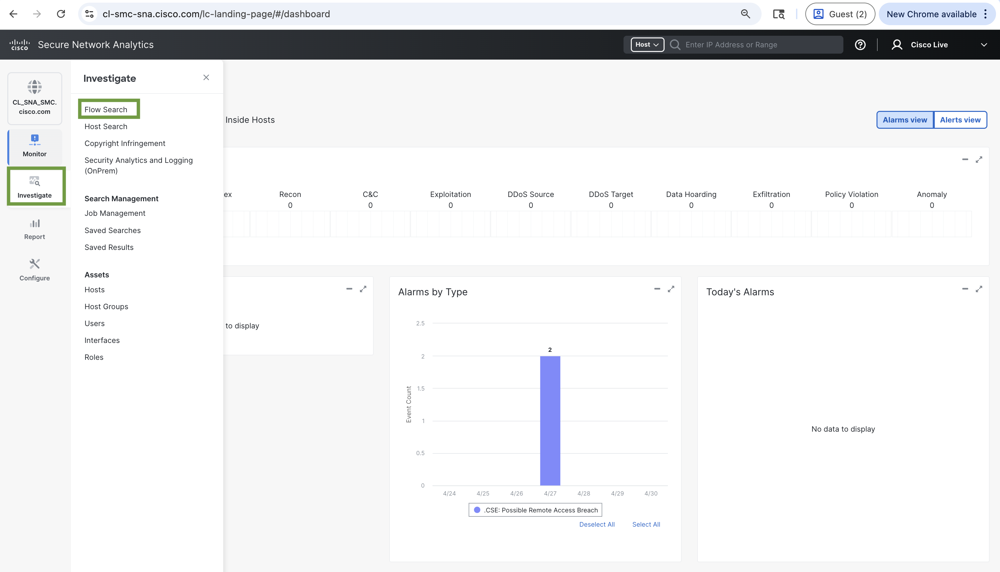
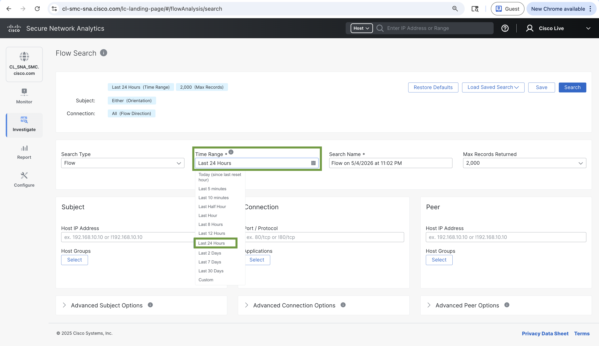
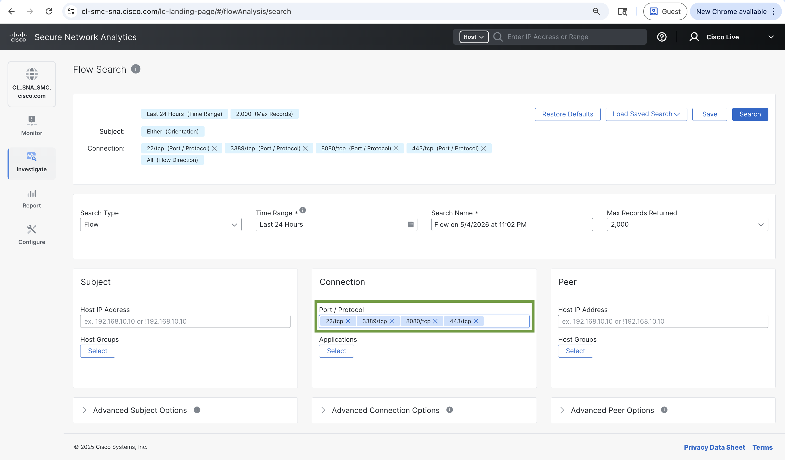
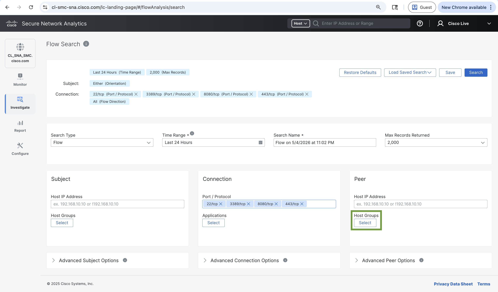
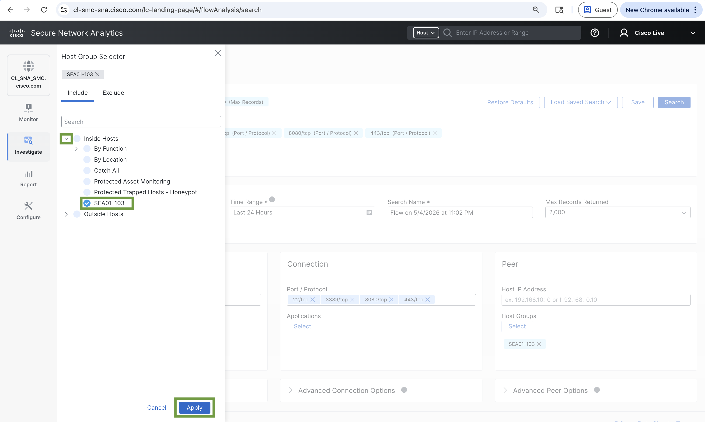
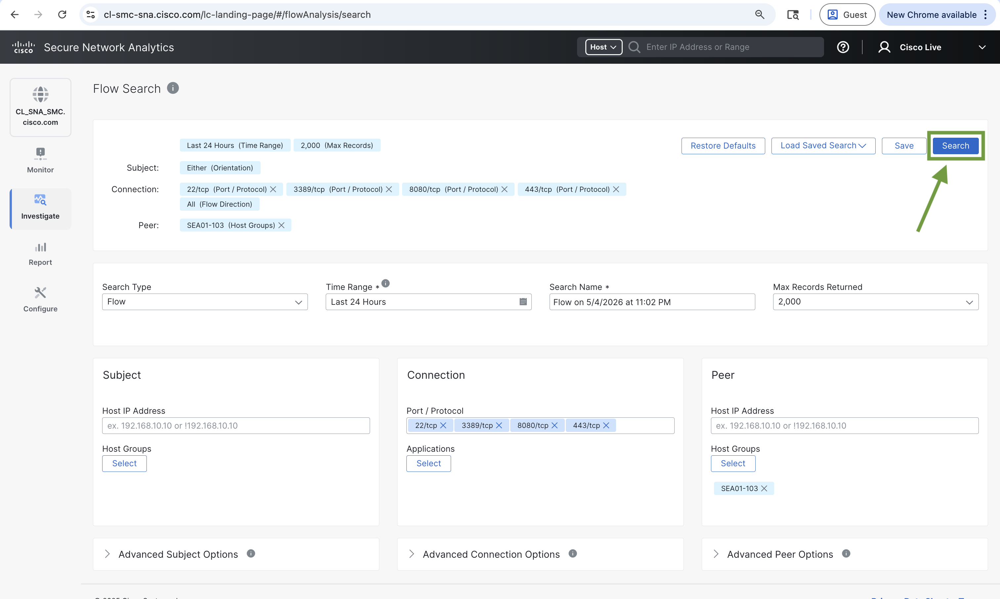
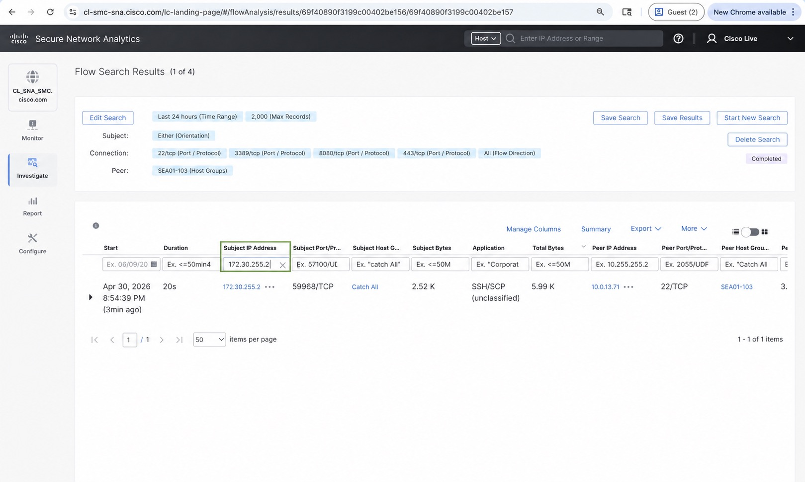

# Task 2: Analyzing SEA01-103 Network Traffic – Flow Search

In the previous tasks, you simulated network traffic within your **SEA01-103 Host Group**. In this task, you will analyze the recently captured **NetFlow** data directly on the **SNA Manager** using **Flow Search**. You will build a targeted search to isolate flows related to your **lab traffic**, filter results to your specific **workstation**, and export the data as a **CSV** report for offline asset utilization review.

**Flow Search** provides a powerful, on-box method for investigating network conversations — complementing the **Splunk-based analysis** you will perform in the **next task**.

## Step 1: Access Flow Search on the **SNA Manager**

| Field | Value |
| ----- | ----- |
| URL        | [https://cl-smc-sna.cisco.com/sw-login/](https://cl-smc-sna.cisco.com/sw-login/){target=_blank} |
| Username   | `CiscoLive`                                          |
| Password   | `CL2026SNAandSplunkDemo!`                            |

- Open **Google Chrome**.
- Browse to the **URL** in the table above to open the **SNA Manager** (**Flow Search**). Sign in using the **Username** and **Password** from that same table.
- From the top navigation menu, choose **Investigate → Flow Search**.

    

    <figure markdown>
      
    </figure>
    

## Step 2: Set the time range

- Open the **Time Range** control and select **Last 24 hours**.

    

    <figure markdown>
      
    </figure>
    

## Step 3: Enter Port / Protocol values

- In the **Port / Protocol** field, enter each of the following values one at a time, pressing **Spacebar** after each entry:

    !!! warning "Entering Port / Protocol"
        You must enter each **Port/Protocol** value individually, then press the **Spacebar** to commit it as a **token (chip)** before typing the next one.

    | Entry | Action |
    | --- | --- |
    | 22/TCP | Type `22/TCP`, then press **Space** |
    | 3389/TCP | Type `3389/TCP`, then press **Space** |
    | 8080/TCP | Type `8080/TCP`, then press **Space** |
    | 443/TCP | Type `443/TCP`, then press **Space** |

- After all four entries, confirm you see **four distinct tokens** in the field.

    

    <figure markdown>
      
    </figure>
    

## Step 4: Select the SEA01-103 host group

- In the **Peer** tile, under **Host Groups**, click **Select**.

    

    <figure markdown>
      
    </figure>
    

- In the side panel, expand **Inside Hosts** (click **>**).
- Select **SEA01-103**, then click **Apply**.

    

    <figure markdown>
      
    </figure>
    

## Step 5: Run the Flow Search

- With all the **search criteria** configured, click **Search** to generate the results. **Time range** should show **Last 24 hours**.

    

    <figure markdown>
      
    </figure>
    

    !!! Note "What to expect?"
        A **Flow Search** can return a large number of results, much of it unrelated to your specific **lab traffic**. In the **next step**, you will filter the results to show only the flows you generated in **Task 1**.

## Step 6: Validate your network activity

- In the **Subject IP** filter, enter the **Client (IPv4)** you recorded in **Task 1**, **Step 1** (Cisco Secure Client **AnyConnect VPN** after **VPN** connects).

    !!! warning "Lost your client IPv4?"
        Reopen **Cisco Secure Client** and open **AnyConnect VPN** screen (same path as **Task 1**). Copy the **Client (IPv4)**. For example: `172.30.255.2` — **yours will differ.**

    After entering the **Subject IP**, the **results grid** should be updated to show only flows tied to your sessions. Verify that the filtered results show flows corresponding to the traffic you generated in **Task 1**. You should see entries for the following **protocols**:
    - Close the browser window when you are finished.

    | Protocol/Port | Service | Expected Activity |
    | ------------- | ------- | ------------------- |
    | 22/TCP | SSH | Shell access to ISR4K-CL (`10.0.13.70`) and CAT9K-CL (`10.0.13.71`) — matching the SSH sessions you generated in **Task 1**, **Steps 2 and 3** |
    | 443/TCP | HTTPS | Secure web management access to CAT9K-CL (`10.0.13.71`) and SNA Management Console (`10.0.13.50`) — matching the HTTPS sessions you generated in **Task 1** |

    !!! note "What to Expect"
        Since you accessed **ISR4K-CL** via **SSH**, **CAT9K-CL** via both **SSH** and **HTTPS**, and the **SNA Management Console** via **HTTPS** in **Task 1**, your filtered results should primarily show flow records for **22/TCP** and **443/TCP**.

    

    <figure markdown>
      
    </figure>
    

## Result

Review the data and confirm:

- **Source IPs** — Do they align with **your** **Client Address (IPv4)** from **Task 1**?
- **Destination IPs** — Do they correspond to devices inside **SEA01-103**?
- **Protocols** — Do you see SSH(22/TCP) and HTTPS(443/TCP) where you expect?								
- **Time range** — Do **Start Time** and **End Time** fall in the window when you generated traffic in **Task 1**?

By successfully retrieving **flow records** that match the traffic you generated in **Task 1**, this task proves that **Cisco Secure Network Analytics** can capture **NetFlow** telemetry to provide meaningful **asset utilization** visibility. The report demonstrates that **SNA** records every network conversation — including **who** accessed which device, over **what protocol**, **how much** data was transferred, and **when** the access occurred — giving you the data needed to monitor and assess **asset utilization** across your environment.

---
