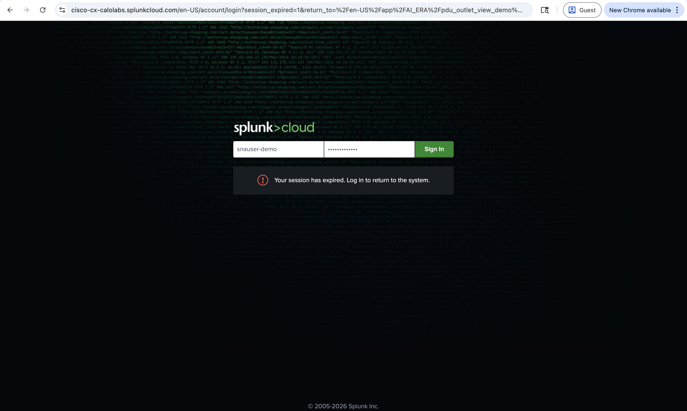
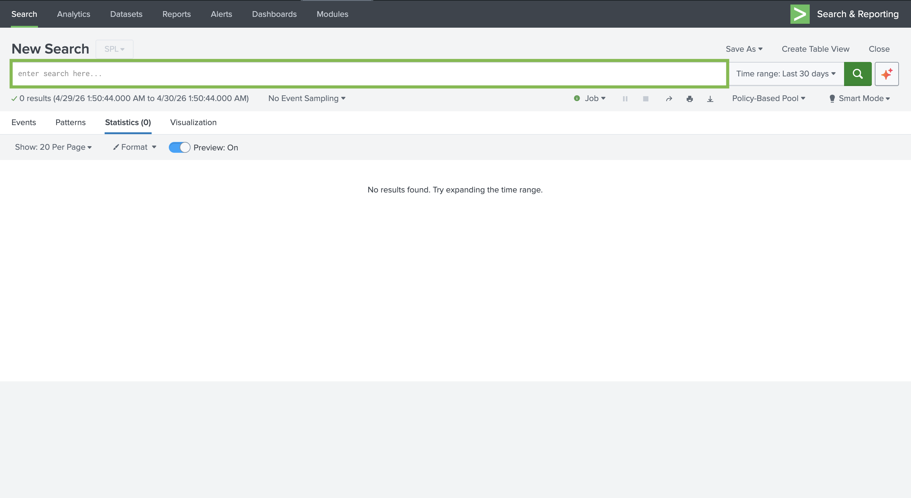
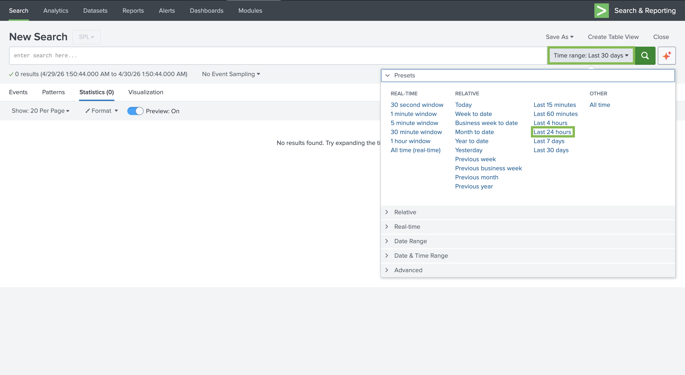
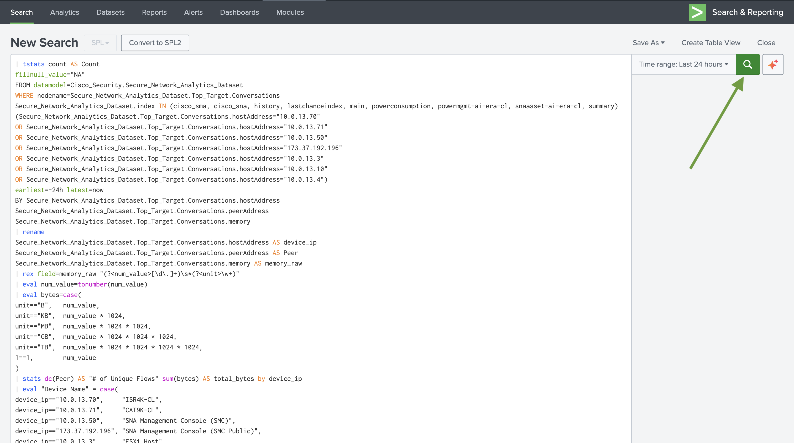
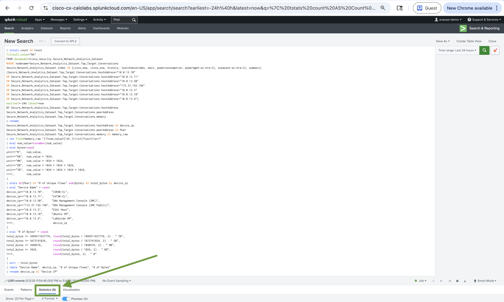
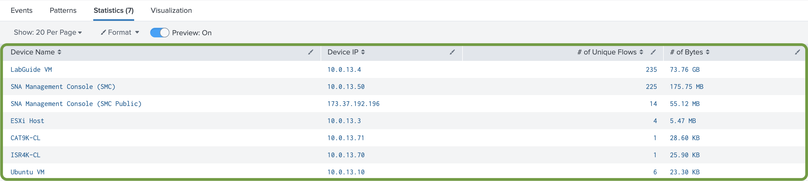

# Task 3: Identifying Top Utilized Hosts

## Objective

In this task, you will use a pre-built **Splunk** query to identify the **top utilized hosts** across your network. By leveraging **flow telemetry** data collected by **Cisco Secure Network Analytics (SNA)** and exported to **Splunk Cloud**, you can determine which devices are generating the most network activity — measured by **unique flow conversations** and **total bytes transferred**.

This visibility is critical for **asset utilization** monitoring, helping you pinpoint heavily utilized devices, detect unusual traffic patterns, and make informed **capacity planning** decisions across your **distributed data center** environment.

## Step 1: Open Splunk Cloud Search

- Click the link to open the Splunk Cloud dashboard, then log in using the credentials provided below.

    | Field | Value |
    | ----- | ----- |
    | URL | [https://cisco-cx-calolabs.splunkcloud.com/en-US/app/search](https://cisco-cx-calolabs.splunkcloud.com/en-US/app/search/search?earliest=-30m%40m&latest=now){target=_blank} |
    | Username | `snauser-demo` |
    | Password | `Ciscolive!135` |

    <div class="dashboard-imgs" markdown>
    <figure markdown>
      
    </figure>
    </div>
  
- After clicking the URL, you will land on **New Search** page with the main **search bar** (placeholder `enter search here...`) to the left of the **time range** control. The results area may show **Statistics** / **No results found** until you run a search and widen time if needed.

    <div class="dashboard-imgs" markdown>
    <figure markdown>
      
    </figure>
    </div>

- Click the time range control next to the search bar. Click the Presets menu and choose Last 24 hours, then apply so the picker reflects that window.												
												

    <div class="dashboard-imgs" markdown>
    <figure markdown>
      
    </figure>
    </div>

## Step 2: Enter the Top Utilized Hosts Query

Copy and paste the following query into the Splunk search bar:

```bash
| tstats count AS Count
fillnull_value="NA"
FROM datamodel=Cisco_Security.Secure_Network_Analytics_Dataset
WHERE nodename=Secure_Network_Analytics_Dataset.Top_Target.Conversations
Secure_Network_Analytics_Dataset.index IN (cisco_sma, cisco_sna, history, lastchanceindex, main, powerconsumption, powermgmt-ai-era-cl, snaasset-ai-era-cl, summary)
(Secure_Network_Analytics_Dataset.Top_Target.Conversations.hostAddress="10.0.13.70"
OR Secure_Network_Analytics_Dataset.Top_Target.Conversations.hostAddress="10.0.13.71"
OR Secure_Network_Analytics_Dataset.Top_Target.Conversations.hostAddress="10.0.13.50"
OR Secure_Network_Analytics_Dataset.Top_Target.Conversations.hostAddress="173.37.192.196"
OR Secure_Network_Analytics_Dataset.Top_Target.Conversations.hostAddress="10.0.13.3"
OR Secure_Network_Analytics_Dataset.Top_Target.Conversations.hostAddress="10.0.13.10"
OR Secure_Network_Analytics_Dataset.Top_Target.Conversations.hostAddress="10.0.13.4")
earliest=-24h latest=now
BY Secure_Network_Analytics_Dataset.Top_Target.Conversations.hostAddress
Secure_Network_Analytics_Dataset.Top_Target.Conversations.peerAddress
Secure_Network_Analytics_Dataset.Top_Target.Conversations.memory
| rename
Secure_Network_Analytics_Dataset.Top_Target.Conversations.hostAddress AS device_ip
Secure_Network_Analytics_Dataset.Top_Target.Conversations.peerAddress AS Peer
Secure_Network_Analytics_Dataset.Top_Target.Conversations.memory AS memory_raw
| rex field=memory_raw "(?<num_value>[\d\.]+)\s*(?<unit>\w+)"
| eval num_value=tonumber(num_value)
| eval bytes=case(
unit=="B",   num_value,
unit=="KB",  num_value * 1024,
unit=="MB",  num_value * 1024 * 1024,
unit=="GB",  num_value * 1024 * 1024 * 1024,
unit=="TB",  num_value * 1024 * 1024 * 1024 * 1024,
1==1,        num_value
)
| stats dc(Peer) AS "# of Unique Flows" sum(bytes) AS total_bytes by device_ip
| eval "Device Name" = case(
device_ip=="10.0.13.70",     "ISR4K-CL",
device_ip=="10.0.13.71",     "CAT9K-CL",
device_ip=="10.0.13.50",     "SNA Management Console (SMC)",
device_ip=="173.37.192.196", "SNA Management Console (SMC Public)",
device_ip=="10.0.13.3",      "ESXi Host",
device_ip=="10.0.13.10",     "Ubuntu VM",
device_ip=="10.0.13.4",      "LabGuide VM",
1==1,                         device_ip
)
| eval "# of Bytes" = case(
total_bytes >= 1099511627776, round(total_bytes / 1099511627776, 2) . " TB",
total_bytes >= 1073741824,    round(total_bytes / 1073741824, 2) . " GB",
total_bytes >= 1048576,       round(total_bytes / 1048576, 2) . " MB",
total_bytes >= 1024,          round(total_bytes / 1024, 2) . " KB",
1==1,                         round(total_bytes, 2) . " B"
)
| sort - total_bytes
| table "Device Name", device_ip, "# of Unique Flows", "# of Bytes"
| rename device_ip AS "Device IP"
```
With the SPL still in the **search bar**, start the job:

- Click **Search** on the right side of the search bar (Splunk Cloud often shows a **green magnifying-glass** icon). Wait for the job to finish. 

    <div class="dashboard-imgs" markdown>
    <figure markdown>
      
    </figure>
    </div>

- The scroll down to see results

    <div class="dashboard-imgs" markdown>
    <figure markdown>
      
    </figure>
    </div>

## Step 3: Review the Results

The results table displays the top utilized hosts in descending order of total bytes transferred. Each row represents a unique device in your network.

| **Column** | **Description** |
| --- | --- |
| Device IP | The IP address of the host observed in flow data |
| # of Unique Flows | The number of distinct peer conversations the host participated in over the past 24 hours |
| # of Bytes | The total volume of data transferred by the host, displayed in a human-readable format (MB, GB, etc.) |

!!! Note
    The results are sorted in descending order by total bytes to surface the most heavily utilized hosts first. To reverse the sort, simply click the **# of Bytes** column header in the Splunk results table — this will toggle the sort order to ascending, displaying the least utilized hosts at the top. This can be useful for identifying underutilized or idle assets that may be candidates for decommissioning or resource reallocation.

For this lab query, open the **Statistics** tab so the host ranking appears as a table (`Device Name`, **Device IP**, **# of Unique Flows**, **# of Bytes**).

<div class="dashboard-imgs" markdown>
<figure markdown>
  
</figure>
</div>

## Step 4: Interpret the Results

Use the results to answer the following questions about your network:

1. **Which host has the highest data transfer volume?** The host at the top of the table is your most heavily utilized device. In a data center context, this could be a busy application server, a hypervisor like your ESXi host, or even the SNA Manager itself processing telemetry.

2. **Which host has the most unique flow conversations?** A high number of unique flows indicates a device communicating with many distinct peers. This is typical for devices such as load balancers, DNS servers, or management appliances.

3. **Are there any unexpected devices at the top?** If a device you do not expect to see appears with high utilization, this could indicate misconfiguration, unauthorized activity, or a need for further investigation.

## Result

In this task, you identified the top utilized hosts in your network based on unique flow count and bytes transferred. This provides a high-level view of which devices are most active. In the next task, you will drill deeper into the specific communication patterns behind that utilization.

---
