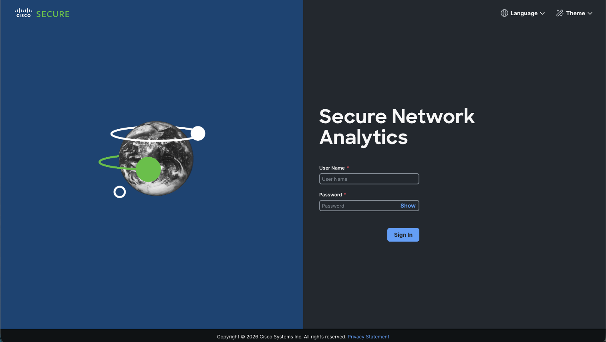

# Task 4: Analyzing SEA01-103 NetFlow – Flow Search

After simulating network traffic within your SEA01-103 Host Group, you will now analyze the recently captured Netflow on the SNA Manager. Using Flow Search, you will generate a report that provides insight into the utilization of your SEA01-103 assets.

## Step 1: Accessing Flow Search in SNA Dashboard

- Open Google Chrome, enter or paste this URL in the search bar: https://10.0.13.50/
- Enter your username and password, then select Sign In.

<figure markdown>
  
</figure>

- Navigate to Investigate > Flow Search.

<figure markdown>
  
</figure>

## Step 2: Setting Flow Search criteria

!!! important "Goal of this search"
    Build a view of **recent flows for SEA01-103**, then **narrow to your workstation** using the **Subject IP** filter (the **Client Address (IPv4)** you wrote down in Task 3) so exports match the traffic you generated—not the whole lab.

!!! tip "Port / Protocol tokens"
    Enter each **Port/Protocol** value (for example `22/TCP`), press **Space** to commit it as a chip or token, then type the next. The UI must show discrete entries—not one long concatenated string.

- Click the Time Range dropdown and select Last 24 hours

<figure markdown>
  
</figure>

-  In the Port / Protocol field, enter each of the protocols below. To correctly enter them, you must type each individually, followed by pressing the Spacebar.
- 22/TCP > [Spacebar]
- 3389/TCP > [Spacebar]
- 8080/TCP > [Spacebar]
- 443/TCP > [Spacebar]

<figure markdown>
  
</figure>

- In the Peer tile, under Host Groups, click Select.

<figure markdown>
  
</figure>

- In the side-panel, click (>) beside Inside Hosts to expand the dropdown, select SEA01-103 and then Apply.

<figure markdown>
  
</figure>

- Now that your Flow Search criteria are set, select Search to generate the results.

<figure markdown>
  
</figure>

A Flow Search can return a large grid, much of it unrelated to **your** lab traffic. For the utilization export, restrict rows to the flows you generated in Task 3.

- In the **Subject IP** filter, enter the **Client Address (IPv4)** you recorded in **Task 3, Step 1** (Status Overview after VPN connects).

!!! note "Lost your client IPv4?"
    Reopen **Cisco Secure Client** and return to **Status Overview** (same path as Task 3, Step 1). Copy **Client Address (IPv4)** again. Example from the draft: **172.30.255.10** (yours will differ).

After filtering, the grid should show flows tied to **your** sessions. Export **Visible Columns** to download a **CSV** of what is on screen.

- Select Export, then Visible Columns, to download your asset utilization report.

<figure markdown>
  
</figure>

- Close the browser window to end your session.

## Result

You ran **Flow Search** against **SEA01-103**, filtered to **your client IPv4**, and exported **Visible Columns** as a **CSV** for offline review.

!!! note "Splunk in the next task"
    Flow records land on the **Data Node** after collection. **REVISIT:** Replace “connect directly to the Data Node database” with the **exact Splunk integration** the team documents (HEC, DB Connect, intermediate export, app-specific connector, and so on). Task 5 is the Splunk walk-through.

---