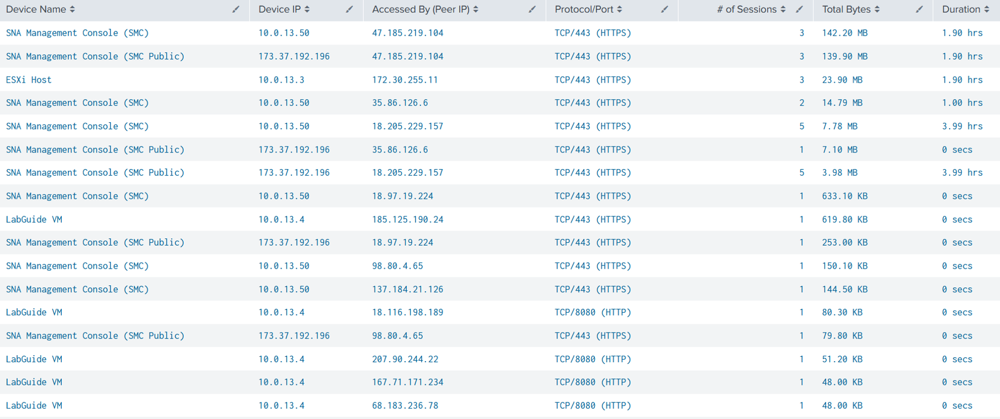

# Task 4: Analyzing Top Flows — Who Accessed What, How, and For How Long

## Objective

In this task, you will use a Splunk query to analyze the top network flows across your environment. While **Task 3** identified the busiest devices, this task answers the deeper questions about network activity:

- **Who** is accessing resources? (**Source IP**)
- **What** are they accessing? (**Destination IP**)
- **How** are they accessing it? (**Protocol/Port**)
- **How** long did the access span? (**Duration**)

Understanding these access patterns is essential for asset utilization monitoring, security auditing, and operational troubleshooting. By examining flow conversations captured by Cisco Secure Network Analytics (SNA) and exported to Splunk Cloud, you gain a comprehensive view of how devices in your data center communicate with each other.

## Step 1: Open Splunk Cloud Search

1. If you are continuing from **Task 3**, click the **Search** bar to clear the previous query.

2. If you are starting fresh, log in to Splunk Cloud and navigate to **Search & Reporting.**

3. Ensure the time picker is set to **Last 24 hours.**

## Step 2: Enter the Top Flows Query

Copy and paste the following query into the Splunk search bar:

<div class="spl-lab-scroll" markdown="1">

```spl
| tstats count AS "# of Sessions"
fillnull_value="NA"
FROM datamodel=Cisco_Security.Secure_Network_Analytics_Dataset
WHERE nodename=Secure_Network_Analytics_Dataset.Top_Target.Conversations
Secure_Network_Analytics_Dataset.index IN (cisco_sma, cisco_sna, history, lastchanceindex, main, powerconsumption, powermgmt-ai-era-cl, snaasset-ai-era-cl, summary)
(Secure_Network_Analytics_Dataset.Top_Target.Conversations.hostAddress="10.0.13.70"
OR Secure_Network_Analytics_Dataset.Top_Target.Conversations.hostAddress="10.0.13.71"
OR Secure_Network_Analytics_Dataset.Top_Target.Conversations.hostAddress="10.0.13.50"
OR Secure_Network_Analytics_Dataset.Top_Target.Conversations.hostAddress="173.37.192.196"
OR Secure_Network_Analytics_Dataset.Top_Target.Conversations.hostAddress="10.0.13.3"
OR Secure_Network_Analytics_Dataset.Top_Target.Conversations.hostAddress="10.0.13.10"
OR Secure_Network_Analytics_Dataset.Top_Target.Conversations.hostAddress="10.0.13.4")
(Secure_Network_Analytics_Dataset.Top_Target.Conversations.portLabel="22 (TCP)"
OR Secure_Network_Analytics_Dataset.Top_Target.Conversations.portLabel="443 (TCP)"
OR Secure_Network_Analytics_Dataset.Top_Target.Conversations.portLabel="8080 (TCP)")
earliest=-24h latest=now
BY Secure_Network_Analytics_Dataset.Top_Target.Conversations.hostAddress
Secure_Network_Analytics_Dataset.Top_Target.Conversations.peerAddress
Secure_Network_Analytics_Dataset.Top_Target.Conversations.portLabel
Secure_Network_Analytics_Dataset.Top_Target.Conversations.memory
Secure_Network_Analytics_Dataset.Top_Target.Conversations.percent
_time
| rename
Secure_Network_Analytics_Dataset.Top_Target.Conversations.hostAddress AS device_ip
Secure_Network_Analytics_Dataset.Top_Target.Conversations.peerAddress AS "Accessed By (Peer IP)"
Secure_Network_Analytics_Dataset.Top_Target.Conversations.portLabel AS port_raw
Secure_Network_Analytics_Dataset.Top_Target.Conversations.memory AS memory_raw
Secure_Network_Analytics_Dataset.Top_Target.Conversations.percent AS percent
| eval "Device Name" = case(
device_ip=="10.0.13.70",     "ISR4K-CL",
device_ip=="10.0.13.71",     "CAT9K-CL",
device_ip=="10.0.13.50",     "SNA Management Console (SMC)",
device_ip=="173.37.192.196", "SNA Management Console (SMC Public)",
device_ip=="10.0.13.3",      "ESXi Host",
device_ip=="10.0.13.10",     "Ubuntu VM",
device_ip=="10.0.13.4",      "LabGuide VM",
1==1,                         device_ip
)
| eval "Protocol/Port" = case(
port_raw=="22 (TCP)",   "TCP/22 (SSH)",
port_raw=="443 (TCP)",  "TCP/443 (HTTPS)",
port_raw=="8080 (TCP)", "TCP/8080 (HTTP)",
1==1,                    port_raw
)
| rex field=memory_raw "(?<num_value>[\d\.]+)\s*(?<unit>\w+)"
| eval num_value=tonumber(num_value)
| eval bytes=case(
unit=="B",   num_value,
unit=="KB",  num_value * 1024,
unit=="MB",  num_value * 1024 * 1024,
unit=="GB",  num_value * 1024 * 1024 * 1024,
unit=="TB",  num_value * 1024 * 1024 * 1024 * 1024,
1==1,        num_value
)
| stats
sum(bytes) AS total_bytes
sum("# of Sessions") AS "# of Sessions"
min(_time) AS first_seen
max(_time) AS last_seen
by "Device Name", device_ip, "Accessed By (Peer IP)", "Protocol/Port"
| eval duration_secs = last_seen - first_seen
| eval "Duration" = case(
duration_secs >= 86400, round(duration_secs / 86400, 2) . " days",
duration_secs >= 3600,  round(duration_secs / 3600, 2) . " hrs",
duration_secs >= 60,    round(duration_secs / 60, 2) . " mins",
duration_secs >= 0,     round(duration_secs, 0) . " secs",
1==1,                   "N/A"
)
| eval "Total Bytes" = case(
total_bytes >= 1099511627776, round(total_bytes / 1099511627776, 2) . " TB",
total_bytes >= 1073741824,    round(total_bytes / 1073741824, 2) . " GB",
total_bytes >= 1048576,       round(total_bytes / 1048576, 2) . " MB",
total_bytes >= 1024,          round(total_bytes / 1024, 2) . " KB",
1==1,                         round(total_bytes, 2) . " B"
)
| sort - total_bytes
| table "Device Name", device_ip, "Accessed By (Peer IP)", "Protocol/Port", "# of Sessions", "Total Bytes", "Duration"
| rename device_ip AS "Device IP"
```

</div>

Click the Search button (▶) to execute the query.

## Step 3: Review the Results

The results table displays the top network flows in descending order of total bytes transferred. Each row represents a unique combination of source device, destination device, and protocol/port used for communication.


| **Column** | **Question It Answers** | **Description** |
| --- | --- | --- |
| Source IP | Who is accessing? | The IP address of the device initiating the connection |
| Destination IP | What are they accessing? | The IP address of the device being accessed |
| Protocol/Port | How are they accessing it? | The protocol and port used for the connection (e.g., TCP/443 HTTPS, TCP/22 SSH) |
| # of Sessions | How frequently? | The number of matching flow sessions observed for this source-destination-protocol combination |
| Total Bytes | How much data? | The total volume of data transferred across all matching sessions, displayed in a human-readable format |
| Duration | How long? | The time span between the first and last observed session for this combination |

Example Output:

!!! Note
    The results are sorted in descending order by total bytes to surface the highest volume flows first. To reverse the sort, simply click the column header of any column in the Splunk results table — this will toggle the sort order to ascending. For example, clicking the **Duration** column header will display the shortest duration flows at the top, which can be useful for identifying brief or transient connections.

<div class="dashboard-imgs" markdown>
<figure markdown>
  
</figure>
</div>

## Step 4: Interpret the Results

Use the results to answer the following questions about your network:

1. **Which source-destination pair has the highest data transfer?** This reveals the busiest communication path in your network. High data transfer between two devices could indicate large file transfers, database replication, backup operations, or heavy application usage.

2. **What protocols and ports are being used most?** Reviewing the Protocol/Port column helps you understand the types of services driving network utilization. For example, heavy HTTPS traffic may indicate web application usage, while SSH traffic may indicate administrative access.

3. **Which connections have the longest duration?** Long-duration flows may represent persistent management sessions, monitoring connections, or long-running data transfers. These are important to identify for both capacity planning and security auditing.

4. **Are there any unexpected access patterns?** Look for source-destination-protocol combinations that seem unusual. For example, a device accessing another device over an unexpected port could indicate misconfiguration or unauthorized access.

5. **How does this relate to the top utilized hosts from Task 3?** By combining the insights from this query with the **Top Utilized Hosts** search from **Task 3**, you can relate **which** devices are busiest to **how** they are being used.

## Result

In this task, you analyzed the top network flows to understand who is accessing what, how they are accessing it, and how long the access spanned. This flow-level visibility complements the host-level view from **Task 3**. A short **Lab summary** and wrap-up are on the **Conclusion** page.

---
