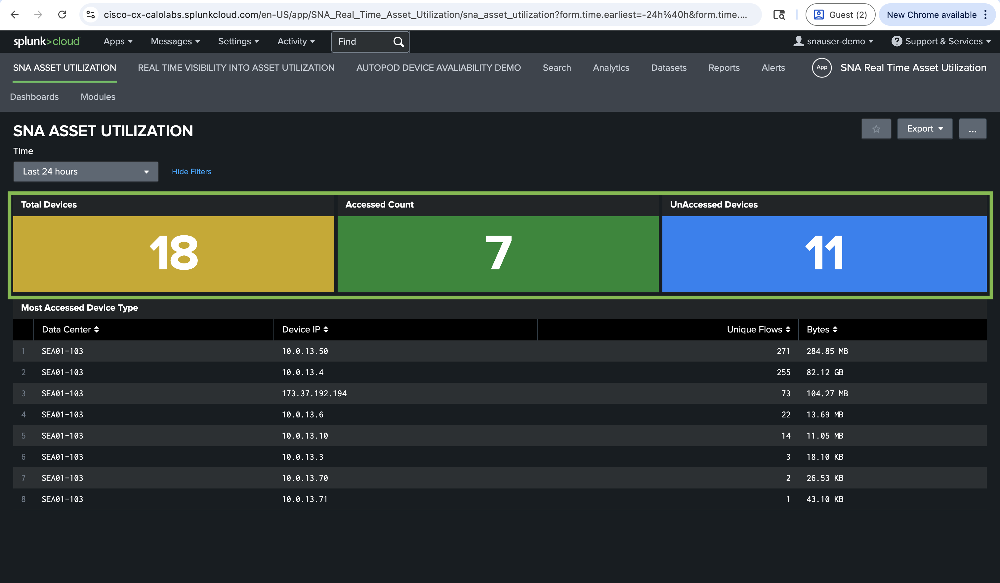
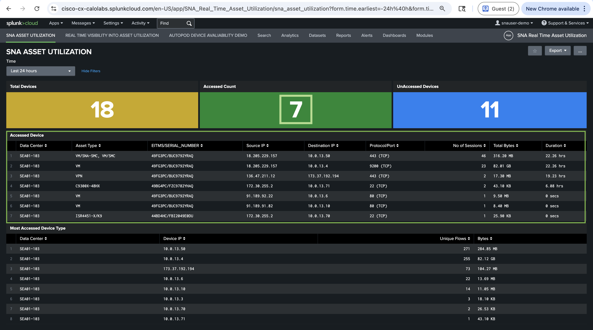
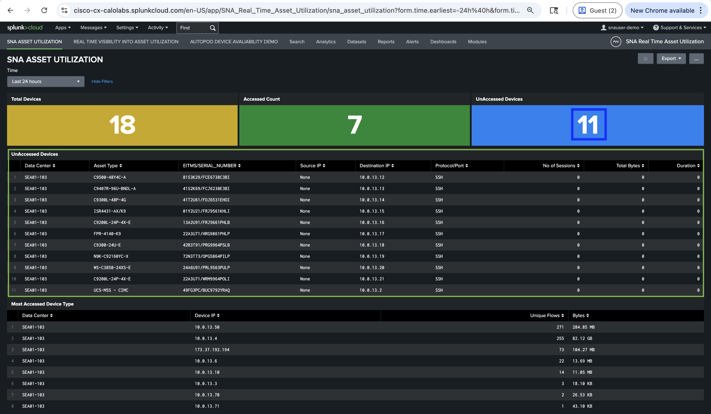
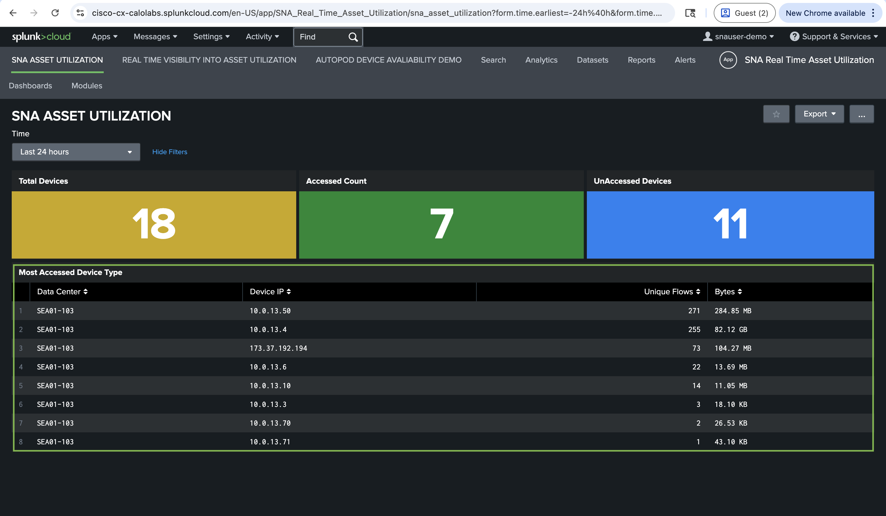

# Task 5: Splunk Dashboard View of Devices Monitored by Cisco Secure Network Analytics

In this task, you will use **Splunk Cloud** to view pre-built **dashboards** that visualize **asset utilization** data collected by **Cisco Secure Network Analytics**. These **dashboards** provide high-level visibility into your **data center** environment — making it easy to determine which devices are actively being accessed, what protocols are being used, and which devices remain idle. This information is critical for identifying **underutilized assets**, supporting **sustainability initiatives**, and making room for **next-generation infrastructure** such as **AI deployments**.

**The dashboards** leverage the same **NetFlow** telemetry you verified in **Task 4**, now presented through

## Step 1: Access the Splunk Cloud dashboard

!!! tip "Use Chrome"
    Run **Splunk** dashboards in **Google Chrome** for the most predictable layout and performance in the lab.

- Open **Google Chrome** and navigate to the following **Splunk Cloud** dashboard URL:

| Field | Value |
| ----- | ----- |
| URL | [https://cisco-cx-calolabs.splunkcloud.com/en-US/app/SNA_Real_Time_Asset_Utilization/sna_asset_utilization](https://cisco-cx-calolabs.splunkcloud.com/en-US/app/SNA_Real_Time_Asset_Utilization/sna_asset_utilization?form.time.earliest=-24h%40h&form.time.latest=now){target=_blank} |
| Username | `snauser-demo` |
| Password | `Ciscolive!135` |

## Step 2: Set Site and Data Center filters

- At the top of the dashboard, locate the **Site** and **Data Center** filter dropdowns.
- Set the filters to the following values:

    - Site: **Seattle**
    - Data Center: **SEA01-103**

- Click **Sign In**.

!!! warning "Match labels exactly"
    Ensure you select **SEA01-103**. Match the labels exactly as displayed in the **Splunk** dashboard.

## Step 2: Review the Device Utilization summary

At the top of the dashboard, **three color-coded panels** provide an immediate snapshot of your data center's **asset utilization** status.

- Observe the three summary panels and note the ratio: out of 17 total devices, only 6 were accessed — meaning over half (11 devices) had no recorded activity in the **last 24 hours**.
- This immediately tells you that a significant portion of your **data center assets** may be **underutilized**, **idle**, or potentially candidates for **decommissioning** or **repurposing**.

<figure markdown>
  
</figure>

| Panel | Color | Value | What It Means |
| ----- | ----- | ----- | ------------- |
| Total Devices | Yellow | 17 | The total number of devices provisioned or discovered in the **SEA01-103** data center. This is your complete inventory baseline. |
| Accessed Count | Green | 6 | The number of devices that have been actively accessed within the **last 24 hours**. These devices are confirmed to be in use. |
| Unaccessed Devices | Blue | 11 | The number of devices with no recorded access in the **last 24 hours**. These are potential candidates for further investigation. |

## Step 3: Analyze accessed devices

Scroll down to the **Accessed Device** table. This table provides detailed information about every device that was accessed within the **selected time window**.

- Click number 7 under accessed devices and note the following observations from the dashboard:

<figure markdown>
  
</figure>

The table contains the following columns:

| Column | Description |
| ------ | ----------- |
| Data Center | The data center where the device resides (**SEA01-103**) |
| Asset Type | The type or model of the device (e.g., VM, ISR4451-X/K9, C9300X-48HX) |
| EITMS/SERIAL_NUMBER | The unique serial number identifying the specific device |
| Source IP | The IP address of the device or user that initiated the connection |
| Destination IP | The IP address of the device that was accessed |
| Protocol/Port | The protocol and port used for the connection |
| No of Sessions | The number of flow sessions recorded for this connection |
| Total Bytes | The total volume of data transferred |
| Duration | The time span of the access activity |

- Note the key insights from the accessed devices:

  - Highest utilization: The VM at 10.0.13.50 (SNA management console) dominates with 329.70 MB transferred over 23.28 hours across 48 sessions using TCP/443— indicating heavy application-level traffic.
  - Network device access: The C9300X-48HX at 10.0.13.71 was accessed via SSH (TCP/22) with 1 session over 6.08 hours
  - The ISR4451-X/K9 at 10.0.13.70 was accessed via TCP(TCP/443) with 25.90 KB bytes transferred.

## Step 4: Analyze unaccessed devices

Click number 11 under Unaccessed Devices table. This is where the real asset utilization story unfolds — these are the 11 devices that had zero recorded access in the last 24 hours.

<figure markdown>
  
</figure>

- Review the unaccessed devices and note the following:

    - All 11 devices show zero sessions, zero bytes, and zero duration — confirming complete inactivity.
    - All 11 devices are monitored via SSH — meaning they are expected to be managed remotely, but no one has connected to them.
    - The devices span a range of Cisco platforms including Catalyst 9000 series switches, ISR routers, Firepower appliances, and Nexus switches.
    - Each device resides in a different data center designation suggesting these are distributed assets across multiple zones.

- Consider what this means for your organization:

    - 11 out of 17 devices (64.7%) in this environment are completely idle.
    - These devices are consuming power, cooling, and rack space without contributing to any active workloads.
    - This is exactly the type of insight that drives sustainability decisions — by identifying these idle assets, organizations can consolidate workloads, decommission unused hardware, and free up physical resources for AI deployments and next-generation infrastructure.

!!! important
    "Unaccessed" means no access was recorded in the selected time window. Before taking any action, always validate with the **asset's owners** and **physical inspection**.									

## Step 5: Analyze the Most accessed Devices

On the Splunk dashboard, locate the Most Accessed Device Type table. Observe the Device IP, Unique Flows, and Bytes columns to identify which assets are most actively accessed across the data center SEA01-103.

Based on your observations, answer the following analysis questions:

<figure markdown>
  
</figure>

- Look at the Most Accessed Device Type table.
- Review the table and observe the Device IP, Unique Flows, and Bytes columns.
- Answer the following analysis questions based on what you see:

### Analysis Questions

**Question 1:** Which device has the highest number of unique flows?

10.0.13.50 with 279 unique flows and 284.01 MB of data.

**Question 2:** Which device has the highest data volume, and what might that indicate?

10.0.13.4 with 82.14 GB of data. Despite having slightly fewer flows (276) than 10.0.13.50, the significantly higher data volume suggests this device is handling large data transfers such as database replication, backups, or file transfers.

**Question 3:** Why does 173.37.192.194 appear in the data center flow data?

173.37.192.194 is the firewall ip used to log in to Cisco Live lab environment.

**Question 4:** Devices 10.0.13.70 and 10.0.13.71 show very low flow counts (2 and 1). What could this indicate?

underutilized assets, Backup or standby systems, recently provisioned devices not yet in active use. This insight helps operations teams identify underutilized resources for optimization.

**Key Takeaway:** The Most Accessed Device Type table provides a clear view of asset utilization across the data center, helping you quickly identify heavily accessed devices, recognize management traffic, and spot underutilized assets.

## Task 5 Summary

In this task, you explored the SNA Asset Utilization dashboard on Splunk Cloud and gained a complete picture of asset utilization across the SEA01-103 data center:

- 18 total devices are provisioned in the environment
- 7 devices (38.9%) were actively accessed in the last 24 hours — confirmed through flow telemetry showing protocols, session counts, bytes transferred, and duration
- 11 devices (66.1%) had zero recorded access — representing idle assets consuming power, cooling, and rack space with no active workloads
- Device Flow Count revealed that utilization is heavily concentrated on a few key devices, with the LabGuide VM alone accounting for over 82.2 GB of traffic

This dashboard proves the value of combining Cisco Secure Network Analytics with Splunk Cloud for asset utilization monitoring. In a real-world data center, this visibility enables operators to identify most accessed asset type, idle hardware, consolidate workloads, reduce energy consumption, and reclaim physical resources — directly supporting sustainability goals and creating capacity for AI and next-generation infrastructure deployments.
